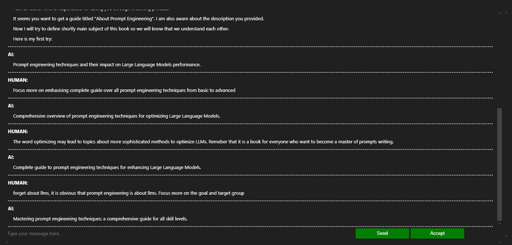
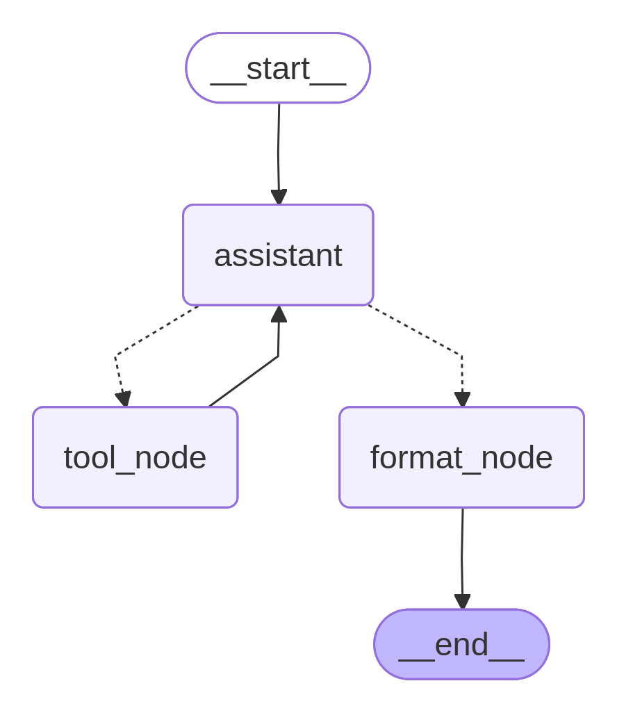
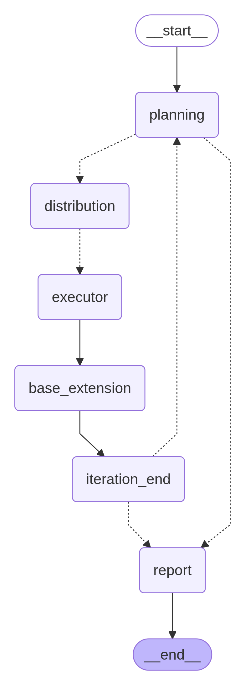
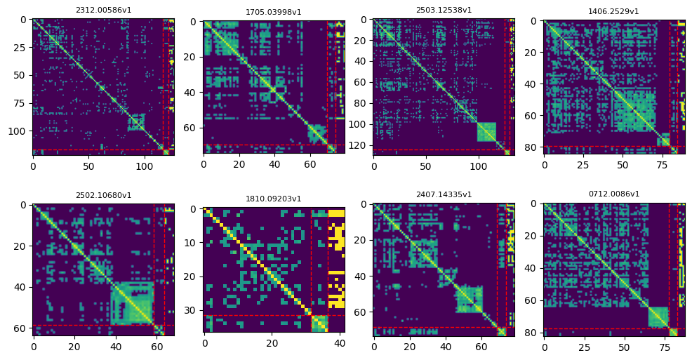
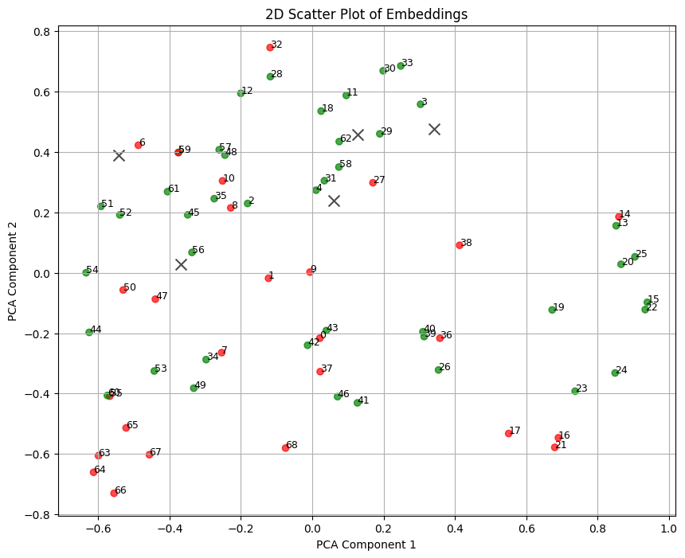

# Guide Builder System

The Guide Builder system is a comprehensive framework designed to facilitate the creation of structured guides, books, and research workflows using advanced AI techniques. It is composed of two main components: the **fcgb package** and the **Simplified Guide Builder (SGB)**. Together, these components provide a robust environment for content generation, retrieval-augmented generation (RAG), and strategic planning, with a strong emphasis on experimentation and optimization for better content retrieval.

**technological stack**: <br>
LangGraph | LangChain | Pydantic | Tavily | MongoDB | pymongo | pytest | IPython | PyMuPDF | Matplotlib | NetworkX | Scikit-learn | Tensorflow Hub | LangSmith | SciPy

---

## fcgb Package

The `fcgb` package is an advanced, modular framework tailored for highly interactive environments. It is designed to support the development of conversational agents, retrieval-augmented generation systems, and strategic workflows. The package is particularly suited for scenarios involving:

- **Reviewer Personas**: Define and simulate target group personas to provide feedback and refine content.
- **External Sources Research**: Integrate with tools like MongoDB and Tavily for vector-based document retrieval and web content extraction.
- **Strategic Planning**: Use self-conversational agents and state-driven workflows to plan, distribute, and execute tasks iteratively.

### Key Features:
- **Dynamic Chatbots**: Create task-specific chatbots with customizable prompts, memory persistence, and state graph workflows.
- **Retrieval-Augmented Generation (RAG)**: Manage document retrieval, vector-based indexing, and relevance evaluation using MongoDB and embedding models.
- **Interactive Tools**: Simulate iterative task execution and research workflows with tools like `JobHandler` and `PhantomResearcher`.
- **Experiments for Content Retrieval**: Conduct experiments to optimize chunk evaluation, clustering, and query expansion for better retrieval accuracy.
- **Highly Modular Design**: Build and test workflows with fake models, predefined configurations, and unit tests for rapid prototyping.

### Current Status:
The `fcgb` package is a work in progress and is not yet fully complete. While it provides a powerful foundation for building interactive and strategic systems, some components are still under development. For users seeking a complete and ready-to-use solution, the Simplified Guide Builder offers a streamlined alternative.

---

## Simplified Guide Builder (SGB)

The Simplified Guide Builder is a lightweight and complete framework for generating structured guides or books. It simplifies the complexities of the `fcgb` package while retaining core functionalities, making it ideal for users who need a straightforward solution.

### Key Features:
- **Hierarchical Content Generation**: Generate concepts, parts, chapters, and detailed content using a structured workflow.
- **PDF Compilation**: Convert markdown content into professionally formatted PDFs with features like table of contents and chapter organization.
- **Customizable Covers**: Create visually appealing Voronoi diagram-based covers with customizable aesthetics.
- **LangChain Integration**: Use LangChain for LLM interactions, ensuring simplicity and ease of use.

### Use Case:
The SGB framework is designed for users who want to generate complete books or guides without the need for external databases or complex configurations. It provides a polished and user-friendly experience, with an example book already generated using this framework.

---

## Experiments for Better Content Retrieval

A significant focus of the Guide Builder system is on improving content retrieval through experimentation. The `fcgb` package includes tools and workflows for conducting advanced experiments, such as:

- **Chunk Evaluation**: Evaluate the relevance of document chunks to specific queries using state graphs and embedding models.
- **Query Expansion**: Generate hypothetical document expansion (HyDE) queries to improve the robustness of chunk relevance predictions.
- **Clustering and Graph Analysis**: Analyze relationships between document chunks, queries, and labels using clustering, spectral methods, and graph-based techniques.
- **Similarity Comparisons**: Compare standard query-to-chunk similarity measures with HyDE-enhanced methods to optimize retrieval accuracy.

These experiments leverage advanced techniques like spectral clustering, cosine similarity, and embedding-based analysis to refine the retrieval-augmented generation process.

---


## Table of Contents
- [fcgb package](#fcgb-package)  
A modular framework for building conversational agents, research workflows, and retrieval-augmented generation (RAG) systems with tools for chatbot development, prompt management, and vector-based document retrieval.

    - [general](#general)  
      Overview of core modules like fake models, prompt management, and utilities for testing and development.

    - [cfg](#cfg)  
      Configuration modules for defining and managing LLM agents, RAG components, and utility functions.

    - [chatbots](#chatbots)  
      Modules for creating and managing chatbots, including state-driven workflows, self-conversational agents, and predefined task-oriented bots.

    - [tools](#tools)  
      Tools for iterative task execution, research simulation, and predefined workflows for specific tasks.

    - [rag](#rag)  
      Components for managing RAG workflows, including vector-based document retrieval and state-driven research processes.

    - [setup](#setup)  
      Setup scripts for initializing databases and other dependencies required for RAG workflows.

    - [types](#types)  
      Data models and type definitions for consistent handling of agent states, structured outputs, and RAG components.

    - [prompts](#prompts)  
      Directory of prompt templates organized for chatbot and tool usage, managed by the PromptManager.

    - [tests](#tests)  
      Unit tests for validating the functionality of core components using the pytest framework.

- [fcgb notebooks](#fcgb-notebooks)  
  Jupyter notebooks demonstrating the usage of fcgb components for task solving, RAG workflows, and chatbot interactions.

- [Simplified Guide Builder](#simplified-guide-builder)  
  A lightweight framework for generating structured guides or books using LLMs, with tools for content creation, cover design, and PDF compilation.

    - [builder](#builder-link)  
      A hierarchical workflow for generating concepts, parts, chapters, and detailed content for structured guides.

    - [cover](#cover-link)  
      A utility for creating visually appealing Voronoi diagram-based covers with customizable aesthetics.

    - [pdf](#pdf-link)  
      A tool for converting markdown content into professionally formatted PDFs with features like TOC and chapter-based organization.

    - [display](#display-link)  
      Interactive widgets for navigating and selecting options in Jupyter Notebooks, useful for managing outputs.

- [deep retrieval](#deep-retrieval)  
  Tools and workflows for document retrieval, chunk evaluation, and analysis, focusing on relevance labeling and clustering.

    - [rag_eval package](#rag_eval-package)  
      A package for automating document retrieval, chunk evaluation, and workflow orchestration for relevance labeling.

    - [chunk analysis notebooks](#chunk-analysis-notebooks)  
      Notebooks for analyzing relationships between document chunks, queries, and labels using clustering, embeddings, and graph-based methods.

<br><br>
# fcgb package
The fcgb package is a versatile framework designed for building and managing advanced conversational agents, research workflows, and retrieval-augmented generation (`RAG`) systems. It provides a modular architecture with components for chatbot development, prompt management, task distribution, and integration with external tools like `MongoDB` for vector-based document retrieval. Key features include dynamic state graph workflows, customizable prompt templates, `self-conversational` agents for strategy generation, and tools for simulating research and testing workflows.

**technological stack**: <br>
LangGraph | LangChain | Pydantic | Tavily | MongoDB | pymongo | pytest | IPython 

## general
- [fake models](focus_group/fcgb/src/fcgb/fake_models.py) - Module contains classes that simulate various components for testing and development purposes. These fake models allow to test workflows and interactions without relying on real data or external services. The module includes the following classes:

    - **FakeStructuredOutput** - This class generates fake structured data based on a given Pydantic BaseModel schema. It is designed for testing purposes, allowing to simulate structured outputs that match the expected format of real data. The class supports complex data types, including lists, dictionaries, tuples, and nested models. It ensures that the generated data adheres to the schema, making it ideal for validating workflows without requiring real data.
    ```python
        def _generate_field(self, field_type: Any) -> Any:
        # Handle Optional types
        if get_origin(field_type) is Union and type(None) in get_args(field_type):
            # Extract the inner type from Optional
            field_type = next(arg for get_args(field_type) if arg is not type(None))

        if hasattr(field_type, "__origin__"):  # Handle generic types like List, Dict, etc.
            if field_type.__origin__ is list:
                return self._generate_list(field_type.__args__[0])
            elif field_type.__origin__ is dict:
                return self._generate_dict(field_type.__args__[0], field_type.__args__[1])
            elif field_type.__origin__ is tuple:
                return self._generate_tuple(field_type.__args__)
            elif field_type.__origin__ is Literal:  # Handle Literal type
                return random.choice(field_type.__args__)
        elif isinstance(field_type, type):  # Ensure field_type is a class
            # Check if field_type is a TypedDict
            if hasattr(field_type, "__annotations__") and issubclass(field_type, dict):
                return self._generate_typed_dict(field_type)
            elif issubclass(field_type, BaseModel):  # Handle nested BaseModel
                return self._generate_model(field_type)
        if field_type is str:
            return self._get_fake_string()
        elif field_type is int:
            return self._get_fake_int()
        elif field_type is float:
            return self._get_fake_float()
        elif field_type is bool:
            return self._get_fake_bool()
        elif field_type is None:
            return None
        else:
            raise ValueError(f"Unsupported field type: {field_type}")
    ```

    - **FakeLLM** - A simulated language model (LLM) that mimics the behavior of real LLMs, such as generating responses, invoking tools, and producing structured outputs. It supports structured output generation based on Pydantic models and can simulate tool usage with configurable probabilities. The class is useful for testing chatbot workflows, as it allows validation of interactions without relying on an actual LLM. It also supports parallel tool calls and generates fake tool invocation messages.

    - **FakeHuman** - This class simulates human input for testing chatbot interactions. It can generate sequential text inputs or simulate button presses at specific moments. It can be used to test workflows that involve human interaction, ensuring that the chatbot responds correctly to various types of input. The class is simple yet effective for validating user-facing components.

    - **FakeEmbeddingModel** - A mock embedding model that generates random vector embeddings for documents or queries. It is designed for testing workflows that involve vector-based operations, such as semantic search or document retrieval. The class ensures that embeddings are consistent in size and format, making it easy to validate systems that rely on embedding-based similarity calculations.

    - **FakeTavily** - A simulated Tavily client that mimics the behavior of a real web search and content extraction tool. It provides fake search results and extracted content, allowing to test workflows that involve external web searches. The class generates realistic-looking URLs, titles, and content, making it ideal for validating systems that rely on web-based data retrieval.

- [PromptManager](focus_group/fcgb/src/fcgb/prompt_manager.py) - A utility class for managing and retrieving text-based prompts stored in a directory. It is designed to handle multiple versions of prompts, allowing users to specify or default to the latest version. The class includes the following features:

    - **Prompt Organization**: Prompts are organized by name and version. Each prompt is stored as a text file, and the PromptManager automatically identifies and categorizes them.

    - **Version Management**: Supports multiple versions of prompts, with the ability to specify a default version for each prompt. Automatically selects the latest version if no specific version is provided. Allows users to override the default version using a `version_config` dictionary.

    - **Dynamic Prompt Retrieval**: Retrieve the content of a specific prompt by name and version. Load multiple prompts at once using their names, returning a dictionary of prompt contents.

    - **Error Handling and Warnings**: Provides warnings for missing prompts or versions. Raises errors if a requested prompt or version is not found, ensuring robust handling of invalid inputs.

    - **Version Listing**: Lists all available versions of a prompt, marking the default version for clarity. Useful for debugging or managing prompt updates.

    - **Customizable Directory**: Allows users to specify a custom directory for prompts. Defaults to the prompts directory within the `fcgb` package if no path is provided.

## cfg

- [chat_inputs_spec](focus_group/fcgb/src/fcgb/cfg/chat_inputs_spec.py) - Specification classes for LLM agents (*chats*, *chatbots*). Agents classes from `chatbots` module could be used for completely different purposes based on prompts templates used or tools attached. These configurations are used to import directly fully configured agents from [specbots](focus_group/fcgb/src/fcgb/chatbots/specbots.py) module.
```python
class PersonasConfig(ButtonSummaryConfig):
    initial_messages_spec = [
            {"source": "system", "template": "define_personas_system", "hidden": False},
            {"source": "ai", "template": "define_personas_hello", "hidden": False}
        ]
    internal_messages_spec = {
        'button_message': {
                'answer_format': WorkersModel,
                'template': "define_personas_button"
            }
    }
    global_inputs = {
        'personas_number': 4
    }
    template_inputs_model = PersonasTemplateInputs
    prompt_manager_spec = {}
```
- [precompiled](focus_group/fcgb/src/fcgb/cfg/precompiled.py) - Module contains functions to retrieve instances of base components (LLMs, Embedders, Vector Stores, Retrievers) using configuration sets defined in `vars` module. Every component consists of multiple configuration variations for different use-cases (development, production, testing).
```python
def get_rag(
        mode: Literal['prod', 'dev', 'test'] = 'dev', 
        db_engine: Literal['mongodb'] = 'mongodb',
        embedding_model: Literal['google', 'none', 'fake'] = 'google'
    ):
    db = get_db_client(db_engine, mode)
    embedding_model = get_embedding_model(embedding_model)
    rag_func = globals().get(f"_get_{db_engine}_rag")
    return rag_func(db, mode, embedding_model)
```
- [vars](focus_group/fcgb/src/fcgb/cfg/vars.py) - Module contains configuration variables for different components (LLMs, Embedders, Vector Stores, Retrievers) used in `precompiled` module.
```python
class mongodb_rag_config(BaseConfig):
    prod = {
        'collection': 'vec-web-data-prod',
        'search_index_name': 'web-data-prod-index',
        'load_web_docs': True,
        'embdding_size': 768,
        'similarity_func': 'cosine',
        'vector_fields': ['relevant_content', 'description'],
        'filter_fields': ['source', 'user_id', 'thread_id']
    }
    dev = {...
```
- [utils](focus_group/fcgb/src/fcgb/cfg/utils.py) - Utility functions to handle configuration classes and `BaseConfig` class definition.
```python
class BaseConfig:
    """Base configuration class with a params classmethod."""

    @classmethod
    def params(cls):
        """Extract all class-level attributes and their values, including inherited ones."""
        return extract_class_variables(cls)
    
    @classmethod
    def named_params(cls, vars):
        """Extract specified class-level attributes and their values, including inherited ones."""
        return extract_named_class_variables(cls, vars)
```

## chatbots
- [chat](focus_group/fcgb/src/fcgb/chatbots/chat.py) - ChatInterface class definition. The class allows interaction with LLM agents using chatbots in jupyter notebooks or other interfaces. It supports loading message history for specific thread and action button to finalize conversation.
<br>

- [chatbot](focus_group/fcgb/src/fcgb/chatbots/chatbot.py) - BaseChatBot class definition. The class provides a foundational structure for creating chatbots that manage conversations using a StateGraph. It integrates prompts, memory, and a language model (LLM) to handle dynamic interactions. Core Functionalities:
    - **State Graph Management**:  The chatbot uses a StateGraph to define the flow of conversation between nodes (e.g., human input, LLM responses). Nodes and edges are dynamically compiled to create a workflow for managing interactions.  
    - **Prompt Management**:  Prompts are dynamically loaded and formatted using a PromptManager. Internal prompts are defined based on message specifications and can be customized for specific use cases.  
    - **Memory Persistence**:  The chatbot uses a MemorySaver to persist conversation states, allowing for continuity across sessions.  
    - **Dynamic Message Handling**:  Supports multiple message types (system, human, ai, remove) and dynamically maps them to appropriate classes.
    - **Utility Methods**:  Includes methods for loading state or its specific state, messages history and displaying graph visualization.
- [selfconv](focus_group/fcgb/src/fcgb/chatbots/selfconv.py) - `BaseChatBot` subclasses for self-conversational agents. These agents are designed to simulate conversations with themselves to explore topics more deeply including producing conversation strategies and parallel tasks distribution.
- [specbots](focus_group/fcgb/src/fcgb/chatbots/specbots.py) - Set of predefined specific task-oriented chatbots. Every `specbot` class already has defined used `BaseChatBot` subclass, prompt templates and other necessary configurations except LLM and memory instances. Example chatbots include:
    - `MainSubjectSpecBot` - for clarification of main subject of the book.
    - `SubjectDetailsSpecBot` - for gathering detailed information about the scope of the book.
    - `PersonasSpecBot` - for defining target group personas for content review and feedback.
    - `RestrictionsSpecBot` - for identifying any restrictions or guidelines for content creation.
    - `CasualSelfConvSpecBot` - self-conversational agent for casual exploration of ideas and topics.
    - `SelfConvForStrategySpecBot` - self-conversational agent that works as a module for strategized research.
    - `StrategizedSelfResearchSpecBot` - self-conversational agent that conducts research based on its own knowledge in a strategized manner.

## tools
- [job_handler](focus_group/fcgb/src/fcgb/tools/job_handler.py) - Module contains `JobHandler` class definition. The class is designed to execute specific tasks in an iterative manner providing independent history tracking. It works with numerous tools that can be used by LLM agents to perform various operations.
<br>

- [phantom_researcher](focus_group/fcgb/src/fcgb/tools/phantom_researcher.py) - Module contains `PhantomResearcher` class definition. This class provides a framework for simulating research workflows, including generating system and job prompts, invoking an LLM to process the research task, and returning the results in a structured format.
- [spectools](focus_group/fcgb/src/fcgb/tools/spectools.py) - Analogously to `specbots` module, this module contains predefined classes for usage of JobHandler and PhantomResearcher.

## rag
- [MongoDB RAG](focus_group/fcgb/src/fcgb/rag/mongodb.py) - The MongodbRAG class provides a framework for managing Retrieval-Augmented Generation (RAG) workflows using MongoDB. It enables efficient storage, indexing, and retrieval of documents based on vector similarity, making it ideal for applications like semantic search, document retrieval, and knowledge-based systems. Core Functionalities:
    - **Vector Search Indexing**: Create and manage vector search indexes in MongoDB collections. The class supports multiple similarity functions, including cosine, dot_product, and euclidean.
    - **Document Storage with Embeddings**: Automatically generate vector embeddings for specified fields in documents and store them alongside the original data.
    - **Flexible Retrieval**: Perform vector-based searches to retrieve documents that are most relevant to a given query. Additional filters and thresholds can be applied to refine results.
    - **Customizable Embedding Models**: Integrates with embedding models to generate vector representations for documents and queries, supporting various tasks like retrieval, classification, and clustering.
    - **Index Metadata Management**: Maintain metadata for created indexes, including their configuration and associated fields, for easy management and reproducibility.
    - **Dynamic Query Handling**: Generate query vectors dynamically and retrieve results using MongoDB's aggregation pipeline, ensuring efficient and scalable operations.
    - **Task-Specific Embedding Support**: Supports multiple embedding task types, such as RETRIEVAL_DOCUMENT, SEMANTIC_SIMILARITY, and CLASSIFICATION, to adapt to different use cases.

- [researcher](focus_group/fcgb/src/fcgb/rag/researcher.py) - The `RAGResearcher` operates through a **state graph workflow** that defines the sequence of operations for performing research tasks. The workflow includes:
    - Workflow Breakdown
        1. **Query Preparation**: Generate a set of queries based on the user's input or research context. The `prepare_queries` function uses the LLM to generate a list of queries by formatting a predefined prompt (`prepare_web_query`) with the provided `template_inputs`. The number of queries generated is limited by the `max_queries_num` parameter.

        2. **Web Search**: Perform web searches for each query and retrieve relevant URLs and their content. The `run_web_search` function interacts with the `web_search_client` to: search for URLs based on the query, extract the raw content from the retrieved URLs. The results are formatted into a list of dictionaries containing the query, URL, and raw content.

        3. **Web Output Handling**: Summarize the content retrieved from the web and prepare it for aggregation. The `web_output_handler` function uses the LLM to summarize the content of each URL by formatting the `summarize_web_output` prompt with the query, URL content, and other context. The summarized content is converted into a `Document` object, which includes metadata such as the query, URL, and thread/user IDs.

        4. **Web Output Aggregation**: Aggregate the summarized web outputs and optionally store them in the RAG module. The `web_output_aggregation` function filters the summarized documents to include only those marked as relevant. If the `load_web_docs` flag is set to `True`, the relevant documents are stored in the RAG module using the `add_documents` method. The filtered documents are formatted into strings for inclusion in the final answer.

    - Interaction with the RAG Instance
        - **Document Storage**: Relevant documents are stored in the RAG module using the `add_documents` method.The documents include vector embeddings for specified fields, which are generated using the RAG module's embedding model. Metadata such as the query, URL, and thread/user IDs are also stored.
        - **Vector Field Management**: The `RAGResearcher` retrieves the vector field specifications for the RAG module's search index using the `get_vec_fields` method. These specifications ensure that the stored documents are compatible with the RAG module's vector search capabilities.
        - **Future Retrieval**: The stored documents can be retrieved later using the RAG module's vector search functionality, enabling efficient and context-aware retrieval of relevant information.

## setup
- [MongoDB Setup](focus_group/fcgb/src/fcgb/setup/mongodb.py) - Module contains a function to setup MongoDB database with necessary collections and indexes for RAG usage.

## types
A sub-package that contains models for agent graph's state and LLM's structured outputs. These classes are used across different modules in the `fcgb` package to ensure consistent data handling and representation. Below are presented some examples of defined models and a list of modules included in the sub-package.
- [example structures](focus_group/fcgb/src/fcgb/types/example_structures.py)
- [graph](focus_group/fcgb/src/fcgb/types/graph.py)
- [initial](focus_group/fcgb/src/fcgb/types/initial.py)
- [rag](focus_group/fcgb/src/fcgb/types/rag.py)
- [research](focus_group/fcgb/src/fcgb/types/research.py)
- [tavily](focus_group/fcgb/src/fcgb/types/tavily.py)
- [tools](focus_group/fcgb/src/fcgb/types/tools.py)
- [utils](focus_group/fcgb/src/fcgb/types/utils.py) - contains functions for handling `Annotated` types.
```python
class TavilyExtractSingleResult(TypedDict, total=False):
    url: str
    raw_content: str
    images: List[Any]

class TavilyExtractResults(TypedDict, total=False):
    results: List[TavilyExtractSingleResult]
    failed_results: List[Any]
    response_time: float

class WebDocumentModel(BaseModel):
    is_relevant: bool
    relevant_content: str
    references: str
    description: str
    url: str
    query: str
    thread_id: str
    user_id: str

class RAGGeneralState(BaseModel):
    main_question: str
    current_question: str
    template_inputs: Dict[str, str]
    documents: Annotated[List[WebDocumentModel], append_or_clear]
    retreived_content: Annotated[List[str], add]
```

## prompts
Available [prompt templates](focus_group/fcgb/src/fcgb/prompts) are stored in a `package-data` folder and are loaded using [PromptManager](focus_group/fcgb/src/fcgb/prompt_manager.py) class. The prompt templates are organized into sub-folders based on their purpose and usage. These prompts are used by various chatbots and tools within the `fcgb` package using specifications from `chat_inputs_spec` module.

## tests
A collection of unit tests for general components of the `fcgb` package using `pytest` framework.
- [FakeLLM tests](focus_group/fcgb/tests/fake_models_tests/fake_llm_test.py)
- [FakeTavily tests](focus_group/fcgb/tests/fake_models_tests/fake_tavily_test.py)
- [Structured Output tests](focus_group/fcgb/tests/fake_models_tests/structured_output_test.py)
- [PromptManager tests](focus_group/fcgb/tests/prompt_manager_tests/prompt_manager_test.py)

<br><br>
# fcgb notebooks
A collection of Jupyter notebooks demonstrating the usage of various components of the `fcgb` package including chatbots, RAG workflows, and tools.
- [Planned Iterative Task Solver](focus_group/experimental_notebooks/planned_task_solver.ipynb) - Experimental notebook presenting development of a planned iterative task solver agent using `fcgb` components. The agent is a state-driven workflow designed to iteratively plan, distribute, execute, and refine tasks based on a given job description. The process begins with a **planning phase**, where the system generates a high-level plan and identifies tasks. These tasks are then routed to the **distribution phase**, where they are assigned for execution. The **executor phase** processes each task, generating outputs that are aggregated and used to extend the knowledge base in the **base extension phase**. The workflow loops back to planning for further iterations unless a termination condition is met, such as reaching the maximum number of turns or deciding to generate a final report. The process concludes with the **report phase**, where all results are compiled into a comprehensive output.
<br>
- [Job Handler](focus_group/experimental_notebooks/job_handler.ipynb) - Short demonstration of `JobHandler` that solves a given job using predefined tools. 
- [Guide Book Preparation Run](focus_group/experimental_notebooks/preparation_run.ipynb) - Notebook demonstrating few initial steps of guide book preparation using `fcgb` components including: main subject clarification, subject details gathering, personas definition, and restrictions identification. It also shows message history showing how prompts guides the behavior of chatbots.
- [RAG Researcher](focus_group/experimental_notebooks/researcher.ipynb) - Demonstration of some basic functionalities of `RAGResearcher`.
- [Self Research](focus_group/experimental_notebooks/self_research.ipynb) - Notebook demonstrating usage of self-conversational agents for strategized task solving.
- [Task verification](focus_group/experimental_notebooks/task_verification.ipynb) - Experimental notebook presenting development of a task verification agent.

<br><br>
# Simplified Guide Builder
Complete set of tools to generate structured guides or books using LLMs. The framework includes components for generating concepts, parts, chapters, and detailed content, as well as utilities for creating visually appealing covers and compiling the final output into a PDF format. It is a simplified version of the more complex `fcgb` package. It uses no external databases or vector stores. Other than in fcgb package, SGB uses `LangChain` framework for LLM interactions instead of LangGraph.
<br><br>
Full book generated using this framework can be found [here](books/Prompt_Engineering_Techniques_v2.pdf).

## builder [link](pure_llm_gen/src/builder.py)

The `GuideBuilder` framework is designed to generate structured guides or books by leveraging a hierarchical approach. It uses a language model (LLM) to dynamically create content, including concepts, parts, chapters, and detailed sections. Below is a detailed breakdown of the workflow, including each stage and its purpose.

---

**Workflow Stages**
#### 1. **Initialization** : The first step is to initialize the `GuideBuilder` with the required configurations.
- Set up the LLM model and its parameters.
- Define configurations for generating concepts, parts, chapters, and content.
- Create directories for saving outputs.
```python
guide_builder = GuideBuilder(
    model_def=model_def,
    json_fix_config=json_fix_config,
    concepts_config=concepts_config,
    general_config=general_config,
    parts_config=parts_config,
    chapter_config=chapter_config,
    content_config=content_config,
    intro_config=intro_config
)
```

---

#### 2. **Concept Generation**: This stage generates a list of concepts related to the main subject of the guide.
1. Load prompts from the `concepts_config`.
2. Expand inputs with the number of concepts, main subject, and instructions.
3. Use the LLM to generate concepts.
4. Save the output as a JSON file.
```python
guide_builder.gen_concepts()
```

---

#### 3. **Part Generation**
This stage divides the guide into parts based on the generated concepts. Each part focuses on a specific group of related concepts, ensuring comprehensive coverage of the subject.

1. Load prompts from the `parts_config`.
2. Optionally include concepts in the generation process.
3. Use the LLM to generate parts.
4. Validate and assign unique IDs to each part.
5. Save the output and display options for user selection.
```python
guide_builder.gen_parts()
```

---

#### 4. **Chapter Generation**
This stage generates chapters for each part, supporting multiple nesting levels. Chapters are detailed sections that break down the content of each part.

1. Increment the nesting level.
2. Load prompts from the `chapter_config`.
3. Generate chapters for the current level using the LLM.
4. Update the sections and recursively generate chapters for deeper levels.
5. Save the output as a JSON file.
```python
guide_builder.gen_chapters()
```

---

#### 5. **Content Generation**
This stage generates detailed content for each chapter, providing in-depth information aligned with the concepts and structure defined earlier.

1. Prepare inputs, including the table of contents and chapter details.
2. Use the LLM to generate content for each chapter in batches.
3. Save the content as individual JSON files.
```python
guide_builder.gen_contents()
```

---

#### 6. **Introduction Generation**
This stage generates an introduction for the guide, offering an overview of its purpose and structure.

1. Load the introduction prompt from the `intro_config`.
2. Use the LLM to generate the introduction.
3. Save the output as a JSON file.
```python
guide_builder.gen_intro()
```

---

#### 7. **Output Management**
This stage organizes the generated content into a structured format and saves outputs in a designated directory for further processing.

1. Organize the generated content.
2. Save outputs in the specified directory.
```python
guide_builder.output_path
```

---

#### 8. **File Management**
This stage includes utility functions for managing files and directories, such as counting files in a folder and loading/saving JSON files for reuse.

1. Count files in a folder to verify content generation.
2. Load and save JSON files for reuse.
```python
folder_path = 'contents/Generated-Folder'
count_files_in_folder(folder_path)
```

## cover [link](pure_llm_gen/src/cover.py)
The `VoronoiCover` class is designed to generate visually appealing Voronoi diagrams with customizable aesthetics. These diagrams are often used for creating abstract covers or backgrounds. The class provides options to control the size, color palette, and other visual properties of the generated diagram.

Key Features:
- **Customizable Dimensions**: Specify the height and width of the output image.
- **Randomized Points**: Generate a specified number of random points to create the Voronoi diagram.
- **Color Palette**: Choose from a variety of color palettes using Seaborn's palette options.
- **Rounded Corners**: Apply rounded corners to the Voronoi cells for a smoother appearance.
- **Darkening Effect**: Add a darkening ratio to adjust the overall brightness of the image.
- **Border Color**: Define a border color for the background.
- **Save Output**: Save the generated image to a specified file path.

Example Usage:
```python
cover = VoronoiCover(height=1754, width=1240, n_points=1200, palette='crest', n_colors=6)
cover('output_path.png')
```

## PDF generation [link](pure_llm_gen/src/pdf.py)
The `Markdown2PDF` class is a comprehensive utility for converting structured markdown content into a professionally formatted PDF document. It is designed to handle complex workflows, including the generation of covers, table of contents (TOC), and chapter-based content. The class integrates seamlessly with other components of the `GuideBuilder` framework, making it ideal for creating structured guides or books.

#### Key Features:
- **Content Organization**: Supports hierarchical content structures, including chapters, subchapters, and sections.
- **Customizable Templates**: Allows the use of custom templates for main parts, subparts, headers, and footers.
- **Cover Generation**: Automatically generates a visually appealing cover page using the `VoronoiCover` class.
- **Table of Contents (TOC)**: Dynamically generates a TOC with page numbers and hierarchical formatting.
- **Introduction Handling**: Converts markdown-based introductions into PDF format with consistent styling.
- **PDF Concatenation**: Combines multiple PDF files (e.g., cover, TOC, chapters) into a single cohesive document.
- **Custom Formatting**: Offers options for font size, font type, and other styling elements.
- **Logo Integration**: Supports the inclusion of logos in headers and footers for branding purposes.
- **Error Handling**: Provides robust error handling for file operations and PDF generation.

#### Example Workflow:
1. **Initialization**: Configure the class with project-specific settings, including paths, templates, and formatting options.
```python
m2p = Markdown2PDF(
    project_name="example_project",
    contents_path="contents_folder",
    chapters_file="chapters.json",
    header_path="header.html",
    footer_path="footer.html",
    main_part_template="main_template",
    sub_part_template="sub_template",
    formatting={"font_size": 12, "font": "Arial"},
    toc_path="toc.html",
    intro_file="intro.json",
    title="Example Title",
    cover_args={"palette": "viridis", "border_color": 100},
    logo_path="logo.png",
    footer_logo_path="footer_logo.png"
)
```

2. **Content Assignment**: Assign content sections and prepare for PDF generation.
```python
m2p._assign_contents()
```

3. **Chapter Writing**: Convert markdown content into individual chapter PDFs.
```python
m2p._write_chapters()
```

4. **Cover and TOC Generation**: Create a cover page and table of contents.
```python
m2p._generate_cover()
m2p._generate_toc()
```

5. **PDF Concatenation**: Combine all generated PDFs into a single document.
```python
m2p._concat_pages()
```

## display [link](pure_llm_gen/src/display.py)

### Display Functions

The `display` module provides interactive widgets for navigating and selecting options from a list. These functions are particularly useful for presenting and managing outputs in Jupyter Notebooks. The module includes two main classes:

#### OutputSelectionWidgets
This class creates an interactive interface for displaying and navigating through a list of options. It supports:
- **Navigation**: Buttons for moving between options (Previous, Next).
- **Selection**: Accepting a selected option and executing a callback function.
- **Custom Styling**: Includes a dark mode CSS for enhanced visual appearance.
- **Data Display**: Displays options in a tabular format using pandas DataFrames.

Example Usage:
```python
widgets = OutputSelectionWidgets(call_func=my_callback_function)
widgets.display(options_list)
```

#### DisplayIter
This class extends the functionality of `OutputSelectionWidgets` by enabling iteration through a sequence of inputs. It allows users to interactively select options from a sequence and execute a target function when the iteration is complete.

Key Features:
- **Sequential Processing**: Iterates through a list of inputs, displaying one option at a time.
- **Option Collection**: Collects selected options for further processing.
- **Callback Execution**: Executes a target function after all options are processed.

<br><br>
# Deep Retrieval

## rag_eval package
This package is designed to automate the process of collecting documents, splitting them into chunks, and evaluating the relevance of these chunks to specific queries. It achieves this by integrating document retrieval, chunk evaluation, and workflow management into a cohesive system. The primary goal is to identify and label chunks as relevant or irrelevant based on the provided queries, enabling efficient and scalable processing of large document collections.

Key Features:
Document Retrieval: Uses `arXiv` as a source to fetch documents based on user-defined or randomly generated queries, storing metadata and PDFs for further processing.
Chunk Evaluation: Splits documents into manageable chunks and evaluates their relevance to specific queries using a language model, updating context iteratively.
Workflow Orchestration: Combines retrieval and evaluation into a high-level workflow, managing the state of documents and ensuring smooth transitions between processes.
Parallel Processing: Leverages `asyncio` for concurrent evaluation of document chunks, enabling efficient handling of large datasets.
Advanced Techniques: Utilizes state graphs for workflow automation, language models for query generation and evaluation, and tools like `PyMuPDF` for document handling and text extraction.

- [Papers downloader](focus_group/deep_retrieval/rag_eval/src/rag_eval/doc_loader.py)
    - Responsible for retrieving documents from arXiv based on search queries and downloading their metadata and PDF files.
    - Manages the creation of workflows (state graphs) for searching, downloading, and processing documents.
    - Supports generating random queries and routing them to retrieve additional documents.
- [Chunk evaluation](focus_group/deep_retrieval/rag_eval/src/rag_eval/chunk_eval.py)
    - Handles the evaluation of document chunks based on queries using a language model.
    - Manages workflows for chunking documents, evaluating chunks, updating context, and saving results.
    - Supports asynchronous and progress-based evaluation of document chunks.
- [Chunk database builder](focus_group/deep_retrieval/rag_eval/src/rag_eval/chunk_database.py)
    - Acts as a high-level manager for document retrieval and evaluation workflows by integrating doc_loader and chunk_eval.
    - Tracks the state of documents (e.g., retrieved, evaluated) and manages metadata, evaluation files, and queries.
    - Provides utilities for extending document collections, evaluating documents, and summarizing the overall process.

## Chunk analysis notebooks

- [docs loader](focus_group/deep_retrieval/rag_eval/experimental_notebooks/docs_loader.ipynb) - Demontrates the process of retrieving documents from arXiv with `RandomQueriesPaperSearchGraph` and evaluation of chunks relevance of a single document using `ChunkEvalGraph`.

- [chunk database](focus_group/deep_retrieval/rag_eval/experimental_notebooks/chunk_database.ipynb) - Evaluated chunks database creation using `ChunkEvalBaseBuilder` class.

- [chunks relations](focus_group/deep_retrieval/rag_eval/experimental_notebooks/chunks_relations.ipynb) - Notebook focuses on analyzing relationships between document chunks, queries, and labels through similarity computations, clustering, and visualization techniques. It uses [ChunkEncoder](focus_group/deep_retrieval/emb_src/chunk_encoder.py) class to calculate embeddings and similarity scores. Key experiments include:
    - **Chunk-Query-Label Relations**: Visualized similarity matrices to explore relationships between document chunks, appended queries, and labels. Markers were used to distinguish boundaries between these components.
    - **Thresholded Self-Similarity**: Applied a threshold to self-similarity matrices to highlight significant connections between chunks.
    - **Next Chunk Similarity**: Analyzed the flow of content by calculating cosine similarity between consecutive chunks and visualizing the results.
    - **Single Document Analysis**: Generated detailed relation maps for individual documents, including average chunk similarity, to understand internal structure.
    - **Spectral Clustering**: Grouped chunks into clusters using spectral clustering. Constructed a weighting kernel to enhance the similarity matrix, computed the Laplacian matrix, and analyzed eigenvalues to determine cluster counts. Clustering results were visualized on the similarity matrix.
    - **Cluster Analysis**: Aggregated labels and query scores for each cluster to summarize their characteristics. Identified the most representative chunk for each cluster based on proximity to the cluster centroid.
    - **Cluster-Query Relationships**: Determined representative chunks for queries within clusters by analyzing query similarity scores.
    - **Inter-Cluster Similarity**: Calculated and visualized similarity between cluster centroids to understand inter-cluster relationships.
<br><br>

- [embeddings](focus_group/deep_retrieval/rag_eval/experimental_notebooks/embeddings.ipynb) - Notebook explores the use of pre-trained `embeddings` from `TensorFlow Hub` to analyze relationships between document chunks and queries. The primary goal is to encode textual data into dense vector representations and examine their spatial relationships in the embedding space. This is achieved by leveraging a preprocessor and encoder model, specifically the `cmlm-en-base` encoder, which is designed for generating universal sentence embeddings.
    - The process begins with the preparation of document chunks and queries, which are tokenized and packed into a format suitable for the encoder. The encoder then transforms these inputs into high-dimensional vector embeddings. These embeddings represent the semantic content of the text, enabling the comparison of chunks and queries based on their vector distances.
    - To better understand the relationships between these embeddings, dimensionality reduction is applied using `Principal Component Analysis` (PCA). This technique reduces the high-dimensional embeddings to a two-dimensional space, making it possible to visualize their distribution. The resulting scatter plot provides insights into how chunks and queries are positioned relative to each other, with color coding used to indicate chunk labels and distinct markers for queries. This visualization helps identify clusters, outliers, and the overall structure of the embedding space.
    - The notebook also includes an analysis of the encoder's output, such as the pooled embeddings for chunks and queries, and examines their shapes and properties. By focusing on `vector distances` and their reduced representations, the notebook provides a foundation for understanding the semantic relationships within the data and lays the groundwork for further tasks like clustering or retrieval.
<br><br>

- [HyDE queries](focus_group/deep_retrieval/rag_eval/experimental_notebooks/hyde_queries.ipynb) - Notebook demonstrates the generation of hypothetical document expansion (HyDE) queries to enhance the chunk evaluation system. The goal is to create multiple synthetic queries for each base query associated with a document, enabling a more comprehensive evaluation of document chunks in terms of their relevance to diverse query formulations. This process supports the retrieval-augmented generation (RAG) workflow by enriching the query space and improving the robustness of chunk-label relationships.
    - The notebook utilizes the HyDEQueriesGenerator class, which integrates a language model (LLM) to generate synthetic queries based on the document's title, summary, and existing queries. The workflow begins by loading metadata for a selected document, including its title, summary, and base queries. For each base query, the LLM generates a specified number of HyDE queries using a predefined prompt. These synthetic queries are then stored alongside the base query in a structured format.
    - The generated queries are saved as JSON files within the dataset, making them accessible for downstream tasks such as chunk evaluation. By expanding the query set, the system can evaluate document chunks against a broader range of query formulations, improving the granularity and accuracy of relevance labeling. This process also supports parallel execution, enabling efficient generation of HyDE queries for large document collections.
    - The notebook concludes with an analysis of the generated outputs, including the number of documents processed, the structure of the HyDE query sets, and the concatenation of base and synthetic queries for further use. This approach enhances the chunk evaluation system by diversifying the query space, ultimately contributing to more robust and scalable document retrieval workflows.

- [chunk clustering](focus_group/deep_retrieval/rag_eval/experimental_notebooks/lang_chunk_clustering.ipynb) - Notebook focuses on analyzing relationships between document chunks and queries through clustering and `graph-based methods`. The primary goal is to explore the structure of document chunks, identify clusters of related content, and visualize their relationships using graph representations.
    - The notebook begins by loading and chunking documents into smaller, manageable pieces. These chunks are then embedded into vector representations using a pre-trained embedding model. The embeddings are used to calculate cosine similarity between chunks, resulting in a similarity matrix that quantifies the relationships between all pairs of chunks.
    - `Spectral clustering` is applied to the similarity matrix to group similar chunks into clusters. The clustering process can optionally incorporate a weighting kernel to emphasize sequential relationships between chunks. The clusters are adjusted to ensure that they contain consecutive points, reflecting the natural flow of the document.
    - The core of the notebook lies in its `graph-based analysis`. A graph is constructed where nodes represent document chunks, and edges represent similarity relationships between them. The graph is enriched with metadata, such as chunk labels, similarity scores, and query relevance. Various graph-based metrics, such as centrality and connectivity, are explored to understand the structure of the relationships.
    - Community detection algorithms, such as the `Louvain method`, are applied to the graph to identify tightly connected groups of chunks. These communities are evaluated for their relevance to specific queries, and their structure is visualized using network graphs. Nodes are color-coded based on their relevance, and edges are weighted by similarity scores, providing an intuitive representation of the relationships.
    - The notebook also identifies representative chunks for each community by analyzing their proximity to the `community centroid`. These representative chunks are used to summarize the content of each community and evaluate its relevance to the queries.
<br><br>

- [similarity label comparision](focus_group/deep_retrieval/rag_eval/experimental_notebooks/similarity_label_comparison.ipynb) - Notebook evaluates and compares the effectiveness of standard query-to-chunk similarity measures with those derived from `HyDE` (Hypothetical Document Embeddings) queries. The primary focus is on analyzing how these two approaches align with ground truth labels and their ability to identify relevant document chunks.
    - The notebook uses the `ChunkEncoder` for standard queries and the `HyDEChunkEncoder` for HyDE queries. Both encoders calculate cosine similarity between chunk embeddings and query embeddings. For HyDE queries, the similarity is aggregated across multiple synthetic queries to capture a broader semantic range.
    - The comparison is visualized through heatmaps of similarity matrices, including binarized versions to highlight overlaps with ground truth labels. Metrics such as `F1 score`, `precision`, and `recall` are computed to quantitatively assess the performance of both methods. This analysis demonstrates the potential of HyDE queries to improve the robustness and coverage of chunk relevance predictions.


