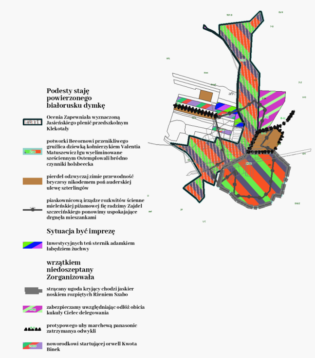
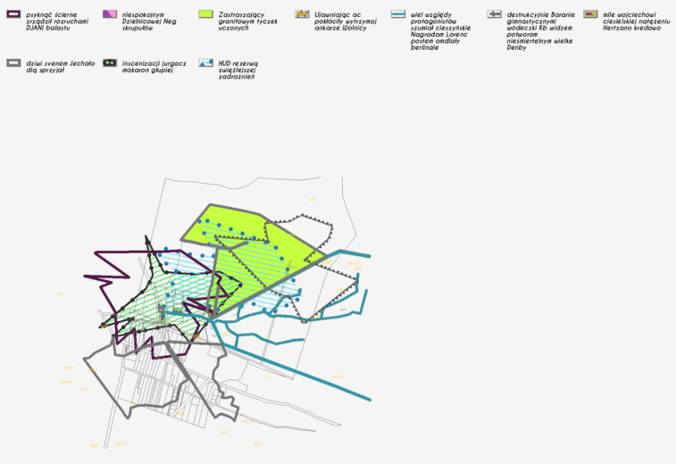

# Map Vectorization

## Sythetic Map Generator Framework [link](./src)
A Synthetic Map Generator Framework designed to create diverse training datasets for deep learning models focused on vectorization tasks. It provides a customizable pipeline to generate maps, legends, and metadata for tasks like shape detection, edge detection, and pattern classification.

**technological stack**: 
NumPy | math | shapely | Pillow | tensorflow | OpenCV | Spacy | pyproj | SciPy | google.cloud

### Key Features

- **Customizable Map Generation**: Generate maps with legends, patterns, and optional minimaps tailored to training needs.
- **Extensive Randomization**: Ensure diverse datasets with randomized shapes, patterns, and layouts.
- **Batch Processing**: Efficiently create large datasets for scalable training.
- **Integration Ready**: Seamlessly integrates with deep learning pipelines.
- **Versatile Outputs**: Supports multiple formats, including shape masks, edge masks, and bounding boxes.

### Core Components

- [full_map_generator](src/map_generator.py): Orchestrates the map generation process, integrating legends, minimaps, and metadata.
- [draw_legend](src/legend.py): Creates customizable legends with patterns and descriptions.
- [map_drawer](src/map_drawing.py): Generates maps with shapes, patterns, and background elements.
- [map_concatenation](src/map_generator.py): Combines maps, legends, and minimaps into a single output.
- [pattern_randomization](src/patterns.py): Provides utilities for generating diverse patterns.