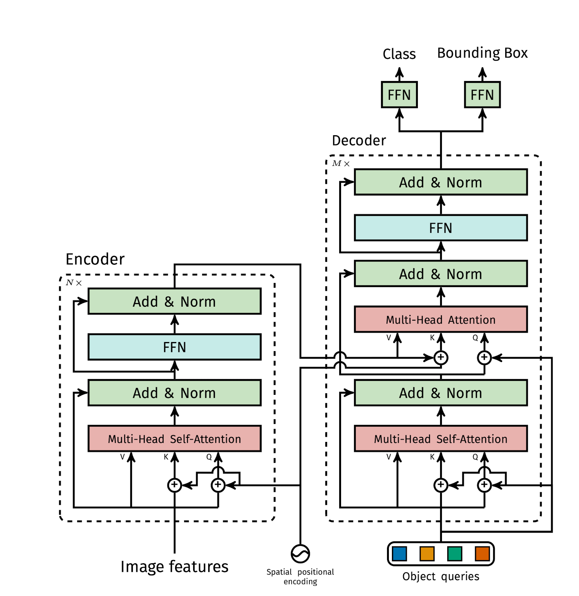
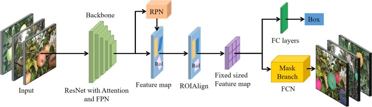
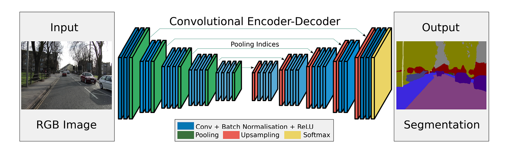
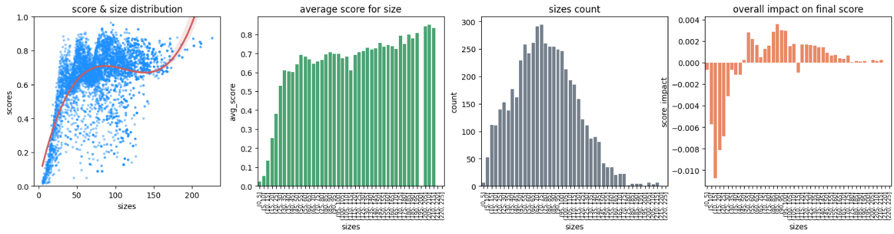
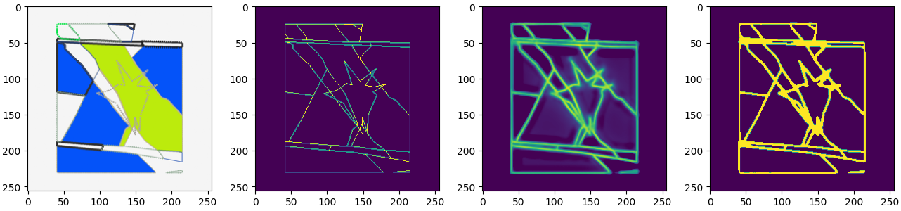

# Map Vectorization

### Table of Contents
- [Sythetic Map Generator Framework](#sythetic-map-generator-framework-link)
- [Architectures](#architectures-link)
    - [DETR](#detr-link)
    - [Mask R-CNN](#mask-r-cnn-link)
    - [U-Net](#u-net-link)
    - [SegNet](#segnet-link)
    - [K-Means](#k-means-link)
    - [Residual Conv Block](#residual-conv-block-link)
- [Minor experiments](#minor-experiments)
    - [RPN Anchor Optimization](#rpn-anchor-optimization-link)
    - [U-Net edge detection with CRF](#u-net-edge-detection-with-crf-link)

## Sythetic Map Generator Framework [link](./src)
A Synthetic Map Generator Framework designed to create diverse training datasets for deep learning models focused on vectorization tasks. It provides a customizable pipeline to generate maps, legends, and metadata for tasks like shape detection, edge detection, and pattern classification.

**technological stack**: 
NumPy | math | shapely | Pillow | tensorflow | OpenCV | Spacy | pyproj | SciPy | google.cloud

### Key Features

- **Customizable Map Generation**: Generate maps with legends, patterns, and optional minimaps tailored to training needs.
- **Extensive Randomization**: Ensure diverse datasets with randomized shapes, patterns, and layouts.
- **Batch Processing**: Efficiently create large datasets for scalable training.
- **Integration Ready**: Seamlessly integrates with deep learning pipelines.
- **Versatile Outputs**: Supports multiple formats, including shape masks, edge masks, and bounding boxes.

### Core Components

- [full_map_generator](src/map_generator.py): Orchestrates the map generation process, integrating legends, minimaps, and metadata.
- [draw_legend](src/legend.py): Creates customizable legends with patterns and descriptions.
- [map_drawer](src/map_drawing.py): Generates maps with shapes, patterns, and background elements.
- [map_concatenation](src/map_generator.py): Combines maps, legends, and minimaps into a single output.
- [pattern_randomization](src/patterns.py): Provides utilities for generating diverse patterns.

  

## Architectures

### DETR [link](./models_src/DETR.py)
Implementation of a DETR-style (DEtection TRansformer) architecture focused on shape detection and optional mask outputs. The implementation is modular and written as Keras layers to allow flexible assembly and inspection for research and custom training.

Key components:

- **SinePositionEncoding**: fixed sinusoidal 2D positional encodings adapted to feature map shapes.
- **LearnablePositionalEncoding**: learnable row/column embeddings that are combined to produce spatial positional vectors.
- **FlatLearnablePositionalEncoding**: small trainable query embedding matrix used as object queries in the decoder.
- **FFN**: configurable feed-forward network (MLP) used inside encoder/decoder blocks and output heads.
- **HeadsPermuter**: utilities to split/collapse the attention head dimension when reshaping tensors for multi-head attention.
- **MHA**: multi-head attention implementation supporting masking, optional soft masking, and returning attention weights when required.
- **DeepLayerNormalization**: normalization variant used inside residual add+norm stacks.
- **EncoderLayer / DecoderLayer**: full transformer encoder/decoder blocks built from the primitives above with residual connections and FFNs.
- **DETRUpConv**: simple upsampling conv-block used when producing dense mask outputs.
- **DETRTransformer**: high-level model assembling a CNN backbone, transformer encoder/decoder stacks and either a detection head (class + bbox) or a mask head.

DETRTransformer behavior and outputs:

- Backbone: a small CNN extracts feature maps which are projected to the transformer attention dimension.
- Encoder/Decoder: stacks of EncoderLayer and DecoderLayer implement cross- and self-attention across spatial tokens and learnable queries.
- Query embeddings: FlatLearnablePositionalEncoding provides learnable queries; ZeroLikeLayer can be used to initialise query objects.
- Output modes: the model can produce per-query detection outputs (class confidences and normalized bboxes) or a dense mask output (upsampled via DETRUpConv blocks). The detection head decodes raw outputs into a dict {class: confidence, bbox: [y1,x1,y2,x2]}.

Training and metrics integration:

- DETRTransformer subclasses `CombinedMetricsModel`, so it integrates seamlessly with custom loss functions that return matched prediction/target pairs and with the model's custom train_step/test_step behavior.
- Use CombinedMetricsModel features to register custom metrics (Hungarian matching losses, IoU, per-head measures) and to compile the model with a loss callable that can return (loss, y_true_matched, y_pred_matched).
- Basic usage pattern: construct DETRTransformer, compile with optimizer and a matching-aware loss, call add_metrics(...) to register additional Keras metrics, then train with model.fit — the model will update custom metrics using matched outputs.

---

### Mask R-CNN [link](./models_src/Mask_RCNN.py)

A concise reference for the Mask R-CNN implementation located at models_src/Mask_RCNN.py. The module provides a complete detection pipeline built from modular components suitable for research and custom training loops on synthetic map data.

Key classes and responsibilities:

- **ResNet4Classification**: lightweight ResNet-based backbone wrapper (supports loading pretrained weights and returning intermediate hidden states for FPN construction).
- **FeaturePyramid**: Feature Pyramid Network (FPN) that equalizes channel dimensions, upsamples and merges backbone features, and optionally adds an extra pooled level.
- **gen_anchors**: deterministic anchor generator for tiled anchor centers and sizes across pyramid levels.
- **NonMaxSupression**: helper layer to select top-k proposals and apply TensorFlow NMS, returning a fixed-size set of proposals per image.
- **RegionProposalNetwork (RPN)**: produces objectness scores and bbox proposals from FPN features; decodes bbox deltas, concatenates multi-level outputs and optionally runs NMS.
- **ROIAligner**: thin wrapper intended to connect multilevel ROI aligners to the model's pyramid format.
- **ProposalPooling**: aggregates per-proposal spatial features (max/mean) into compact descriptors for heads.
- **FPNBBoxHead**: bbox head that performs ROI align, pooling, FC layers and predicts class scores and refined bboxes per proposal.
- **MaskHead**: mask prediction head that aligns ROIs, applies conv stacks and upsampling blocks, and resizes outputs to the target mask resolution.
- **MaskRCNNGenerator**: factory for assembling backbone, FPN, RPN and heads; supports loading weights and switching between component-level outputs.
- **RPNloss**: configurable loss helper that computes model-free anchor scoring, optionally creates training confidences from IoU and returns matched targets for downstream heads.
- **CombinedMetricsModel** (flexible training integration): a Keras Model subclass designed to support custom losses and metrics while enabling custom train_step/test_step logic.
    - Accepts a loss callable that returns (loss, y_true_matched, y_pred_matched) so matching procedures (e.g. Hungarian matching) can be integrated into loss computation.
    - Maintains a registry of custom metrics and updates them using matched ground-truth / prediction pairs, allowing per-head metrics (IoU, Hungarian-style losses, etc.).
    - Implements train_step/test_step to compute gradients, apply optimizers and update custom metrics consistently with the custom loss output.
    - Provides a save wrapper to persist the assembled model structure and weights.

---

### U-Net [link](./models_src/UNet_model.py)

Implementation of a configurable U-Net model located at models_src/UNet_model.py. The module provides a Keras-friendly, easy-to-customize segmentation backbone used for edge detection and mask prediction tasks on synthetic maps.

Key components and responsibilities:

- **UNetConvBlock**: downsampling block combining repeated Conv2D layers, MaxPooling and Dropout; returns both pooled tensor and saved skip connection.
- **UNetUpConvBlock**: upsampling block using Conv2DTranspose followed by Conv2D layers and Dropout; concatenates with saved skip connections to restore spatial detail.
- **UNet**: top-level Keras Model assembling a configurable number of levels, filters, and convolutional layers per level. Supports:
  - variable depth (levels) and initial filter power to scale channel widths,
  - configurable convs-per-level and up/down dropout schedules,
  - optional batch normalization and color embedding input layer,
  - optional output smoothing via an integrated SmoothOutput layer (from models_src.Support),
  - flexible input/output shapes and activation functions.

---

### SegNet [link](./models_src/SegNet_model.py)

Implementation of a SegNet-style encoder-decoder located at models_src/SegNet_model.py. The module provides a Keras-friendly SegNet variant using argmax-based pooling and unpooling to preserve precise spatial locations during decoding for segmentation tasks on synthetic maps.

Key components and responsibilities:

- **MaxPoolingArgMax**: max-pooling that returns pooled features together with argmax indices used later for accurate unpooling in the decoder.
- **ArgMaxUpsample**: unpooling layer that scatters pooled feature values back to their original positions using saved argmax indices.
- **SegNetConv**: flexible convolutional block used in encoder and decoder stages; supports configurable conv depth, batch normalization and ReLU activations, and can operate in pooling or deconv mode.
- **ChannelPooling**: optional lightweight aggregation that reduces channel dimensionality via channel-wise max or average pooling.
- **SegNet**: top-level tf.keras.Model assembling symmetric encoder and decoder stacks, configurable depth, filter scaling, kernel and pool sizes, aggregation mode and final activation.

Behavior and training notes:

- Builds symmetric encoder/decoder stacks using argmax indices to enable spatially-faithful upsampling and better mask reconstruction compared to naive interpolation.
- Supports convolutional aggregation (Conv2D) or channel pooling as the final combination layer and can output single- or multi-channel masks depending on the task.
- Implemented as a tf.keras.Model and performs an initial dummy call to infer shapes; compatible with standard Keras training loops, custom losses and metric loggers.

---

### K-Means [link](./models_src/Kmeans.py)

Implementation of a lightweight K-Means based clustering utility with TensorFlow integration. The module provides tools to cluster image pixels using `sklearn's` `KMeans` and to post-process clusters with TensorFlow ops for smoothing and merging, producing binary masks, centroids and aggregated cluster collections useful for vectorization tasks.

Key components and responsibilities:

- **ImageClusters**: primary class that wraps sklearn KMeans and exposes helpers to compute per-pixel cluster assignments, binary masks per cluster, cluster centroids in image coordinates, and smoothed/merged cluster masks using TF pooling and IoU-based similarity.
- **gen_coords / get_clusters**: utilities to generate pixel coordinate grids and fit KMeans on flattened image pixels to obtain cluster labels.
- **get_coords_centroids / get_cluster_masks**: convert cluster labels into centroid coordinates and binary masks (C, H, W, 1).
- **crossIoU / concatenate_masks**: compute pairwise IoU-like similarity and merge highly-similar clusters into consolidated masks.
- **gen_smoothed_clusters**: TF-augmented pipeline that applies avg/max pooling to cluster masks, computes similarity matrices, and returns combined masks optionally with intermediate similarity scores.

---

### Residual Conv Block [link](./models_src/backbones.py)

Implementation of a lightweight residual convolutional block and small backbone utilities located at models_src/backbones.py. The module provides flexible building blocks for convolutional encoders and a patch-level memorizing backbone used across detection and segmentation pipelines.

Key components and responsibilities:

- **ResidualConvBlock**: Residual block stacking one or more Conv2D layers with optional BatchNormalization, configurable kernel sizes and activation, and a 1x1 projection skip for downsampling when strides>1.
- **gen_residual_stage**: Helper that composes multiple ResidualConvBlock instances into a stage, applying downsampling on the first block and identity-like blocks afterwards.
- **gen_backbone**: Constructs a sequential residual backbone from multiple stages; useful as an image encoder that returns final stage feature maps for downstream heads.
- **gen_memorizing_res_backbone**: Patch-level backbone that first embeds inputs with an FFN then applies ResidualConvBlock layers, collecting intermediate "memory" feature maps and concatenating them. Supports optional 1x1 pixel convs, dropout and selecting a subset of memory indices for output.

  

## Minor experiments

### RPN Anchor Optimization [link](./RPN_optimization.ipynb)

This notebook implements a complete optimization pipeline for designing and validating anchor priors used by a Region Proposal Network (RPN) for parcel detection on synthetic maps. It emphasizes model-free anchor scoring, Bayesian hyperparameter search, diagnostic evaluation across object sizes, and validation inside an end-to-end RPN training loop.

**technological stack**: 
NumPy | TensorFlow | scikit-optimize | SciPy | OpenCV | Matplotlib | Seaborn | pandas | shapely | google.cloud

- Objective: quantify and optimise the fixed-anchor prior for an RPN used in parcel detection on synthetic maps. The notebook treats anchors as a deterministic model prior and searches for configurations that maximize best-case coverage of ground-truth bounding boxes.

- Anchor generator: a deterministic AnchorGenerator maps a compact hyperparameter vector (per-level base sizes, multiplicative scales and pooling window sizes) to an explicit tiled set of anchor bounding boxes across multiple feature-map resolutions.

- Model-free scoring: anchor quality is evaluated with a Hungarian-style matching loss (MultivariantHungarianLoss) applied to anchors treated as fixed predictions. This produces a scalar score (oracle IoU-like coverage) for any anchor configuration without training network weights.

- Bayesian optimisation: the notebook uses gp_minimize to search a constrained parameter space. It optimises monotonically-increasing per-level size increments and symmetric scale factors (e.g. [1.0, s, 1/s, ...]) to enforce multi-scale structure and avoid degenerate solutions.

- Diagnostics: after optimisation, the notebook analyses anchor performance across object sizes (per-size IoU, counts, and per-bin impact on the global score), visualises score distributions explored during search, and computes theoretical ceilings (best-simulation scores) for RPN proposals.

- Integration and validation: optimised anchors are plugged into an RPN loss and a Mask R-CNN-style RPN training loop to check practical effects — empirical IoU, proposal calibration, and training convergence are compared to the oracle bounds computed analytically.

- Input-distribution control: the notebook also includes a complementary optimisation that shapes the synthetic input (parcel size and count distributions) so anchors are tuned to the intended deployment statistics — this closes the loop between data generation and anchor prior selection.

Practical takeaways:
- Optimise anchors using a model-free coverage score before training large models; this saves compute and reveals fundamental limits due to anchor geometry.
- Enforce monotonic anchor sizes across pyramid levels and build symmetric scale variants to obtain robust multi-scale coverage.
- Use per-size diagnostics to spot underserved size ranges and either retune anchors or reshape the synthetic input distribution.
- Validate final anchors inside an end-to-end RPN training run to ensure theoretical improvements translate to empirical gains.

### U-Net edge detection with CRF [link](./Vertex_detection/stages_flow.ipynb)
Implementation of U-Net for edge detection on synthetic maps, enhanced with Conditional Random Fields (CRF) for improved accuracy.
The experiment proofed that edges masks won't be very useful for vertex detection task on images with high concentration of edges.
Linked notebook however shows usage of remote `MLFlow` usage through `DataBricks` platform and integration of `CRF` as a post-processing step for edge refinement.

 

  
