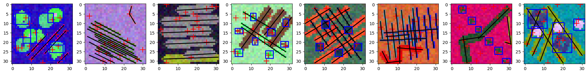
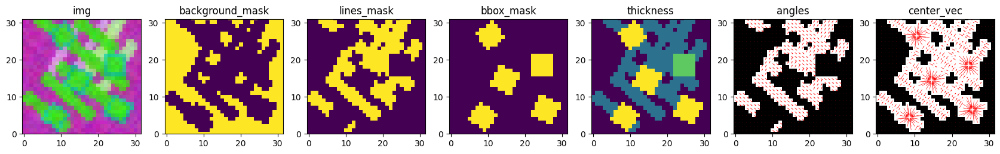
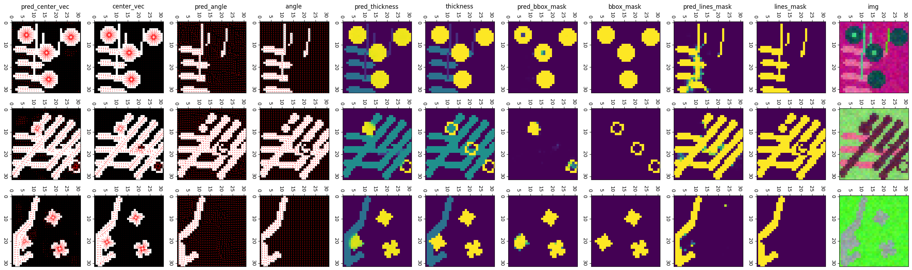
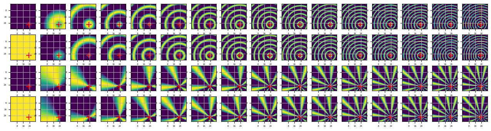
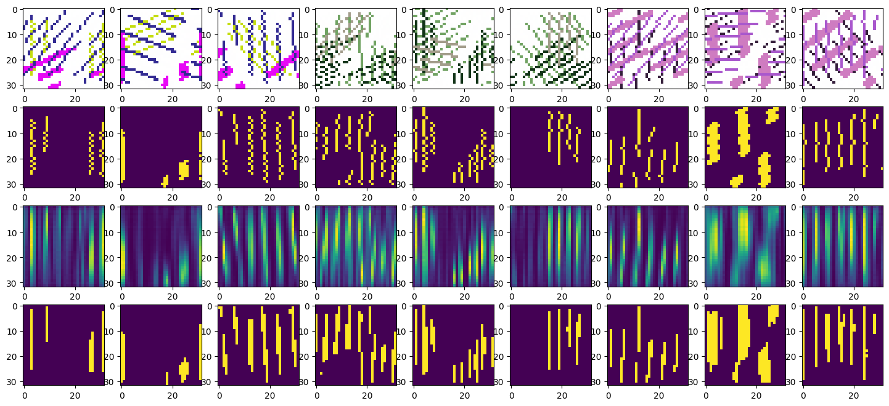
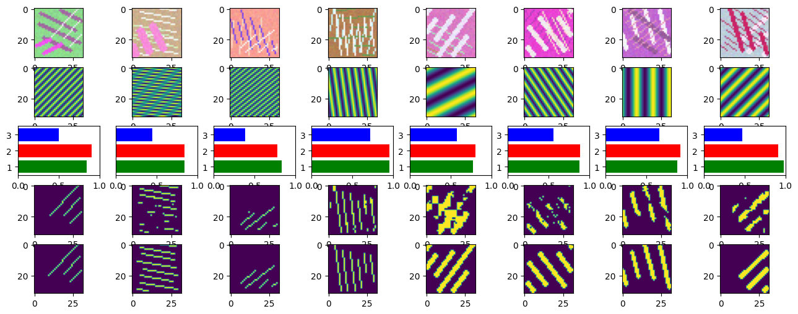
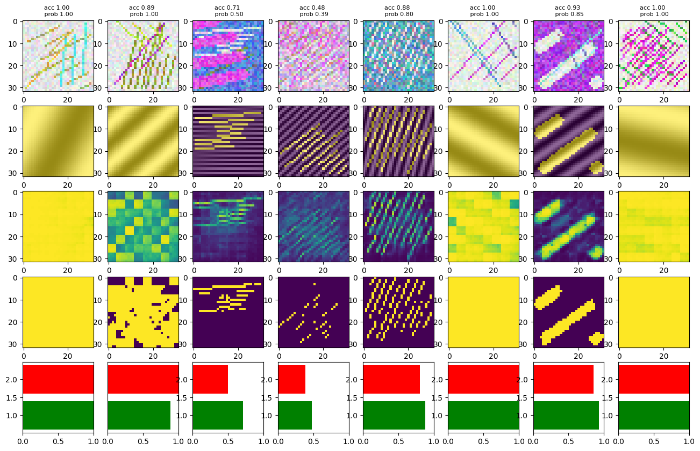
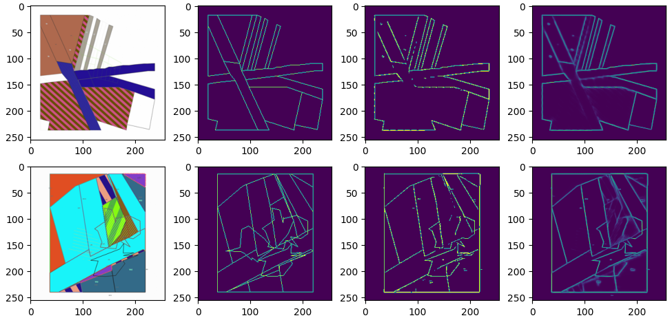

# Map Vectorization

### Table of Contents
- [Sythetic Map Generator Framework](#sythetic-map-generator-framework-link)
- [Simple Patterns Generator](#simple-patterns-generator-link)
- [Relative Radial Positional Encoding](#relative-radial-positional-encoding-link)
- [Experiment Tracking Library](#experiment-tracking-library-link)
- [Frequency-Domain Recognition of Linear Structures in Heavy Noise](#frequency-domain-recognition-of-linear-structures-in-heavy-noise)
- [Architectures](#architectures-link)
    - [DETR](#detr-link)
    - [Mask R-CNN](#mask-r-cnn-link)
    - [U-Net](#u-net-link)
    - [SegNet](#segnet-link)
    - [K-Means](#k-means-link)
    - [Residual Conv Block](#residual-conv-block-link)
- [Minor experiments](#minor-experiments)
    - [RPN Anchor Optimization](#rpn-anchor-optimization-link)
    - [U-Net edge detection with CRF](#u-net-edge-detection-with-crf-link)

## Sythetic Map Generator Framework [link](./src)
A Synthetic Map Generator Framework designed to create diverse training datasets for deep learning models focused on vectorization tasks. It provides a customizable pipeline to generate maps, legends, and metadata for tasks like shape detection, edge detection, and pattern classification.

**technological stack**: 
NumPy | math | shapely | Pillow | tensorflow | OpenCV | Spacy | pyproj | SciPy | google.cloud

### Key Features

- **Customizable Map Generation**: Generate maps with legends, patterns, and optional minimaps tailored to training needs.
- **Extensive Randomization**: Ensure diverse datasets with randomized shapes, patterns, and layouts.
- **Batch Processing**: Efficiently create large datasets for scalable training.
- **Integration Ready**: Seamlessly integrates with deep learning pipelines.
- **Versatile Outputs**: Supports multiple formats, including shape masks, edge masks, and bounding boxes.

### Core Components

- [full_map_generator](src/map_generator.py): Orchestrates the map generation process, integrating legends, minimaps, and metadata.
- [draw_legend](src/legend.py): Creates customizable legends with patterns and descriptions.
- [map_drawer](src/map_drawing.py): Generates maps with shapes, patterns, and background elements.
- [map_concatenation](src/map_generator.py): Combines maps, legends, and minimaps into a single output.
- [pattern_randomization](src/patterns.py): Provides utilities for generating diverse patterns.

  

## Simple Patterns Generator [link](./models_src/VecDataset.py)

A compact but expressive synthetic patterns generator built around `MultishapeMapGenerator` and `DatasetGenerator`. It is a simplified, self-contained variant of the full Synthetic Map Generator Framework, designed specifically for controlled experiments on pattern recognition in highly dense and noisy environments.

Instead of producing full map layouts with legends and minimaps, this module focuses on generating small, information-dense canvases with overlapping linear structures and geometric shapes, together with rich supervision signals for learning.

**technological stack**: 
TensorFlow | NumPy | OpenCV | google.cloud | math

**MultishapeMapGenerator**

- Composes multiple heterogeneous pattern generators into a single synthetic "map":
  - line corridors and double-line bands,
  - flexible polylines with angle constraints,
  - regularly placed shapes along lines,
  - scattered rotated shapes with spacing constraints.
- Applies extensive randomisation of geometry, orientation, spacing, counts and colors, so a single configuration can produce a broad variety of scenes.
- Handles occlusions explicitly: each new pattern is drawn on top of previous ones and only the actually visible portions contribute to masks, vectors, bounding boxes and angle labels.
- Produces a configurable set of outputs in one pass. Depending on requested keys, a sample can include, for example:
  - RGB image with foreground/background colors,
  - per-pixel line/shape masks and class labels,
  - instance-level masks for segments and shape components,
  - vector endpoints and bounding box corners in image coordinates,
  - per-pixel angle and center-vector labels,
  - per-instance and per-pixel thickness and pattern indices.
- Output selection is fully declarative: you specify which outputs you need, and the generator automatically computes only those tensors while keeping them geometrically consistent.

**DatasetGenerator**

- Wraps `MultishapeMapGenerator` into a ready-to-use TensorFlow `tf.data` pipeline.
- Supports two operation modes:
  - on-the-fly sample generation for rapid prototyping and infinite training streams,
  - offline TFRecord creation and reloading for large-scale training or distributed setups.
- Automatically handles batching, padding to fixed maximum numbers of components, shape assignment and optional shuffling.
- Exposes an output filtering mechanism: downstream experiments can keep only the subset of fields required by a particular model (for example, image + angle map, or image + instance vectors, or image + dense segmentation).
- Integrates a flexible preprocessing stage where you can chain high-level operations such as color jitter, blurring, random flips, feature construction, similarity labels or vector-based targets, all expressed as composable dataset transforms.

**Highlighted features**

- Occlusion-aware labeling: visible parts of lines and shapes are recomputed after overlaps so that all masks, vectors, bounding boxes and angles describe only what is actually observable in the final image.
- Multi-task supervision from a single pass: the same synthetic scene can simultaneously provide dense segmentation targets, instance-level geometry, per-pixel angles, center-vectors, thickness and pattern indices, making it suitable for joint training of several heads.
- Angle- and frequency-aware targets: dedicated utilities support rotated encoders, angle-conditioned labels and frequency-space angle masks, enabling experiments on rotation robustness and spectral consistency of learned features.
- Point-based vector supervision: several dataset ops sample points on components and attach local vector, class and thickness labels, which is useful for probe-based models and sparse supervision schemes.
- Tight tf.data integration: the whole pipeline (on-the-fly or TFRecord-based) is expressed as standard dataset transformations, making it easy to plug into custom training loops, add new preprocessing stages or branch dataflows for different model families.

  

## Relative Radial Positional Encoding [link](RRPE.md)

Relative Radial Positional Encoding (RRPE) is a family of geometry-aware positional encodings and attention-based models designed for dense, line‑dominated map vectorization. Instead of describing where a pixel is in the image (absolute x/y), RRPE describes where a pixel is relative to a reference point in polar coordinates (angle and normalized distance). This makes the inductive bias of the model match the geometry of cartographic data: long strokes, rings, junctions and star‑like structures.

The RRPE work in this repository is not a single layer, but a set of related experiments and architectures documented in detail in **RRPE.md** and the linked notebooks. Together, they show that adding a query‑centric radial prior on top of standard CNN/Transformer backbones consistently improves:

- pixel‑wise feature estimation (class, angle, thickness, center‑vector),
- pixel‑to‑pixel similarity and shape masks,
- sample‑centric vector detection (segment endpoints, class, optional thickness),

while keeping the runtime overhead moderate.

### Motivation and idea

Cartographic scenes tend to be dominated by thin, elongated and often intersecting structures. For such data, what matters for a decision at a pixel is usually the **relative** geometry to a few reference points ("along this road", "around this junction"), not the absolute (x, y) in the image. Standard sinusoidal encodings over image coordinates ignore this: they are tied to the image frame, not to the object.

RRPE changes the frame of reference. Given a query point (a pixel or a sample), every other pixel is represented by:

- angle: orientation of the ray from the query to that pixel,
- radius: normalized distance along that ray.

This representation is then encoded either by smooth sector/ring channels or by compact multi‑frequency sin/cos features. Attention uses these encodings as a learned, query‑conditional bias, so it naturally prefers pixels that lie on the same stroke, ring or ray as the query and can suppress distracting parallel structures.

### Families of models using RRPE

The RRPE encodings are exercised in three main model families, all built on synthetic pattern datasets from this repository:

1. **Radial‑encoded pixel features model**  
   A U‑Net–style backbone is augmented with radial attention and trained to predict, per pixel, shape class (line / shape / background), local angle, thickness and a center‑vector pointing to the shape center or line axis. This model is used as a general geometric feature extractor for other experiments. With RRPE, all feature heads see lower validation losses than the plain U‑Net baseline, showing that query‑centric geometry helps recover local orientation and center information in cluttered scenes.

2. **RRPE‑based pixel similarity models**  
   These models output dense pixel‑to‑pixel similarity matrices where each row (for a chosen pixel) acts as a soft mask of “pixels belonging to the same object or stroke”. Combined with a relational similarity loss, RRPE makes these masks substantially cleaner: similarity stays high along the true object even through gaps or weak contrast, and falls off on nearby but distinct lines. This is particularly important for downstream attention‑based architectures that rely on good similarity patterns from the first iteration.

3. **RRPE vector detection models**  
   In a sample‑centric setting, the model receives an image and a set of sample points and predicts, for each sample, one or more vectors (segment endpoints) with class and optional thickness. Here RRPE is centered on each sample: attention looks outwards along rays and rings around the sample and gathers evidence for likely continuations of the underlying stroke. Experiments on synthetic line maps show that RRPE improves endpoint localization and stability in the presence of clutter, crossings and breaks compared to Cartesian encodings or purely convolutional baselines.

Across these families the concrete architectures differ (backbones, number of attention stages, use of backbone features vs colors‑only), but the role of RRPE is the same: provide a strong, query‑relative geometric prior that guides where attention should look.

Overall, RRPE confirms that rephrasing positional information in a query‑centric radial frame is an effective way to inject geometric knowledge into attention mechanisms for map vectorization. The code and experiments in **RRPE.md** can serve both as a reference implementation of relative radial encodings and as a set of end‑to‑end examples for integrating them into feature extractors, similarity models and vector detectors.

  

## Experiment Tracking Library [link](./exp_lib)

A configuration‑driven MLOps layer built around TensorFlow/Keras and MLflow that turns the synthetic map generators and models in this repo into reproducible, scriptable experiments. Instead of hard‑coding data pipelines, architectures and training loops inside notebooks, `exp_lib` externalizes them into JSON configs and small Python modules, so notebooks become thin drivers for well‑defined pipelines.

In a typical workflow you pick a **general config** and an **MSMG config** to describe how synthetic maps should look, then choose a **model definition JSON** that points to a generator function and a compiler module. A dataset generator script turns the configs into `tf.data` pipelines, while a trainer loader script builds a `TrainingProcessor2` instance that knows how to compile, fit and log the model. The notebook only sequences these steps: config → dataset → trainer + model → training + MLflow → metrics and plots.

Where this becomes particularly effective is with complex, multi‑output, geometry‑aware models. Compiler modules in `exp_lib` assemble optimizers and structured losses for tasks like joint prediction of shape class, angle, thickness and center‑vectors, and attach per‑head metrics that understand angles, vector lengths and distances. The same high‑level pattern works across different architectures (U‑Net, RRPE models, similarity heads, vector detectors) because the trainer treats them as black‑box generators described purely by config.

The dataset layer reuses `MultishapeMapGenerator` and `DatasetGenerator` to produce dense synthetic supervision — TFRecord‑backed or on‑the‑fly — with configurable preprocessing and GCS support. A single configuration can feed several models and experiments, and the output‑filtering and preprocessing hooks make it straightforward to expose only the tensors a particular head needs without rewriting the pipeline.

MLflow integration is wired through the trainer and utility scripts: each run records not only metrics and weights, but also the full model definition and compiler arguments. Helper functions download these artifacts, reconstruct models, and cache them locally so trained networks can be treated as backbones and plugged into new pipelines via a simple loader call. Metric‑validation and plotting scripts live next to the library and reuse the same datasets and trainers, which keeps evaluation and visualization reproducible and easy to repeat when configs change.

For day‑to‑day work, `dict_widget` provides an interactive way to adjust JSON‑defined hyperparameters from a notebook before compiling, while the final accepted configuration is pushed back to MLflow. Combined with optional `KerasTuner` integration in `Trainer`/`BuildHyperModel`, this makes `exp_lib` suitable both for fast iteration on research ideas and for running larger, systematically tracked deep learning campaigns on the synthetic map tasks in this repository.

  

## Frequency Domain Recognition of Linear Structures in Heavy Noise
This section presents methods for detecting and segmenting linear patterns in images with significant noise, using frequency-domain techniques. The focus is on two main approaches: angle-shifted straightening combined with a Transformer-based mask predictor, and frequency proposal generation with scoring.

### angle_shift — Rotation/Straightening and Mask Prediction [link](./Fourier/angle_shift.ipynb)

original img | label | prediction | binarized prediction

#### Objective and Setup
Goal: detect and segment repetitive linear patterns under heavy noise by first canonicalizing orientation and then learning a mask predictor.
- Synthetic images with controlled line directions, spacing (frequency), and phases enable full supervision and stress testing.
- Small resolutions (32×32 or 64×64) emphasize efficiency and aliasing robustness.
- TensorFlow/Keras drive modeling; custom Fourier tools render lines and provide frequency context.

#### Angle-Shifted Straightening (Canonicalization)
Make lines “look horizontal” before learning to reduce rotational variance:
- Coarse 90° rotations (rot90_preprocessing) bring dominant angles near horizontal.
- Fourier-domain straightening uses a complex phase matrix D that compensates residual slope; I' = IFFT(FFT(I)·D) avoids resampling artifacts.
- Randomized slope jitter and mask smoothing stabilize labels under noise.
Effect: diverse orientations collapse into a canonical frame, focusing the model on periodicity and contrast.

#### Dataset: VecRotDataset
Generates straightened training examples:
- Renders RGB images and binary masks from Fourier line parameters, then applies rotation + straightening.
- Emits ((I_str, F_str), M): straightened RGB, aligned cosine frequency map, and smoothed mask.
- Batches are “squeezed” so each transformed instance is an independent sample.

#### Sequence-Style Attention Model for Mask Prediction
Treat straightened images as 1D sequences along the aligned axis:
- Permute/reshape, add positional encodings, and fuse a learned embedding of the frequency channel.
- Stacked Transformer-like EncoderLayers (MHA + FFN) capture long-range periodic dependencies.
- Trained with Binary Focal Cross-Entropy; metrics include Weighted F1. Robust segmentation is achieved even under heavy noise.

#### Findings (angle_shift)
- Canonicalization is decisive: rot90 + Fourier straightening simplifies learning and speeds convergence.
- Frequency context helps: an aligned cosine channel stabilizes masks in the presence of severe noise/color jitter.
- Top spectral peaks plus small shift search (explored qualitatively here) align well with true spacing/orientation in the straightened space.

### lin_freq_adj — Frequency Proposals and Scoring [link](./Fourier/lin_freq_adj.ipynb)

original img | frequency base | loss_label-confidence-F1 | binarized prediction | label

#### Frequency Proposals from 2D Spectra
Connect masks with explanatory frequencies:
- TopKFreqs computes the 2D FFT, normalizes amplitudes, suppresses DC/low bins and the lower half-plane, then selects energetic coordinates. Dominant phase is recovered and used to synthesize cosine maps (I_uvx).
- GaussianMixtureComponents optionally clusters intensities; extracting TopKFreqs per cluster reduces interference from crossings or mixed textures.

#### Local Shift Optimization in Frequency Space
Refine peak coordinates:
- FreqShiftOptimization searches a small grid around (u, v) and scores synthesized maps against cluster masks using F1/IoU.
- Returns refined (u, v, phase) and corresponding vector proposals rendered back in the image. This corrects quantization, finite-size, and noise-induced offsets.

#### Dataset for Proposal Quality and Scoring Model
Build supervision for proposal usefulness:
- Labels derive from a decomposed FreqLoss blending frequency magnitude error, orientation (angle) error, and phase alignment into a single [0,1] score.
- VecDataset samples proposals (often from TopKFreqs), renders cosine maps, and stores TFRecords for scalable training.
- A probability model freezes a line-detection backbone, extracts multi-level encoder features, and applies cross-attention with frequency patches and positional encodings to predict proposal quality (MAE-trained; F1-style decision metrics reported).

#### Findings (lin_freq_adj)
- Top-k peaks are a strong baseline; local shift search significantly tightens alignment to observed patterns.
- Learned scoring outperforms raw spectral energy by conditioning on real image evidence via detection features.
- Cluster-wise extraction decomposes complex scenes, improving precision under crossings/heterogeneity.

original img | label and base frequency | prediction | binarized prediction | confidence-accuracy

  

## Architectures

### DETR [link](./models_src/DETR.py)
Implementation of a DETR-style (DEtection TRansformer) architecture focused on shape detection and optional mask outputs. The implementation is modular and written as Keras layers to allow flexible assembly and inspection for research and custom training.

Key components:

- **SinePositionEncoding**: fixed sinusoidal 2D positional encodings adapted to feature map shapes.
- **LearnablePositionalEncoding**: learnable row/column embeddings that are combined to produce spatial positional vectors.
- **FlatLearnablePositionalEncoding**: small trainable query embedding matrix used as object queries in the decoder.
- **FFN**: configurable feed-forward network (MLP) used inside encoder/decoder blocks and output heads.
- **HeadsPermuter**: utilities to split/collapse the attention head dimension when reshaping tensors for multi-head attention.
- **MHA**: multi-head attention implementation supporting masking, optional soft masking, and returning attention weights when required.
- **DeepLayerNormalization**: normalization variant used inside residual add+norm stacks.
- **EncoderLayer / DecoderLayer**: full transformer encoder/decoder blocks built from the primitives above with residual connections and FFNs.
- **DETRUpConv**: simple upsampling conv-block used when producing dense mask outputs.
- **DETRTransformer**: high-level model assembling a CNN backbone, transformer encoder/decoder stacks and either a detection head (class + bbox) or a mask head.

DETRTransformer behavior and outputs:

- Backbone: a small CNN extracts feature maps which are projected to the transformer attention dimension.
- Encoder/Decoder: stacks of EncoderLayer and DecoderLayer implement cross- and self-attention across spatial tokens and learnable queries.
- Query embeddings: FlatLearnablePositionalEncoding provides learnable queries; ZeroLikeLayer can be used to initialise query objects.
- Output modes: the model can produce per-query detection outputs (class confidences and normalized bboxes) or a dense mask output (upsampled via DETRUpConv blocks). The detection head decodes raw outputs into a dict {class: confidence, bbox: [y1,x1,y2,x2]}.

Training and metrics integration:

- DETRTransformer subclasses `CombinedMetricsModel`, so it integrates seamlessly with custom loss functions that return matched prediction/target pairs and with the model's custom train_step/test_step behavior.
- Use CombinedMetricsModel features to register custom metrics (Hungarian matching losses, IoU, per-head measures) and to compile the model with a loss callable that can return (loss, y_true_matched, y_pred_matched).
- Basic usage pattern: construct DETRTransformer, compile with optimizer and a matching-aware loss, call add_metrics(...) to register additional Keras metrics, then train with model.fit — the model will update custom metrics using matched outputs.

---

### Mask R-CNN [link](./models_src/Mask_RCNN.py)

A concise reference for the Mask R-CNN implementation located at models_src/Mask_RCNN.py. The module provides a complete detection pipeline built from modular components suitable for research and custom training loops on synthetic map data.

Key classes and responsibilities:

- **ResNet4Classification**: lightweight ResNet-based backbone wrapper (supports loading pretrained weights and returning intermediate hidden states for FPN construction).
- **FeaturePyramid**: Feature Pyramid Network (FPN) that equalizes channel dimensions, upsamples and merges backbone features, and optionally adds an extra pooled level.
- **gen_anchors**: deterministic anchor generator for tiled anchor centers and sizes across pyramid levels.
- **NonMaxSupression**: helper layer to select top-k proposals and apply TensorFlow NMS, returning a fixed-size set of proposals per image.
- **RegionProposalNetwork (RPN)**: produces objectness scores and bbox proposals from FPN features; decodes bbox deltas, concatenates multi-level outputs and optionally runs NMS.
- **ROIAligner**: thin wrapper intended to connect multilevel ROI aligners to the model's pyramid format.
- **ProposalPooling**: aggregates per-proposal spatial features (max/mean) into compact descriptors for heads.
- **FPNBBoxHead**: bbox head that performs ROI align, pooling, FC layers and predicts class scores and refined bboxes per proposal.
- **MaskHead**: mask prediction head that aligns ROIs, applies conv stacks and upsampling blocks, and resizes outputs to the target mask resolution.
- **MaskRCNNGenerator**: factory for assembling backbone, FPN, RPN and heads; supports loading weights and switching between component-level outputs.
- **RPNloss**: configurable loss helper that computes model-free anchor scoring, optionally creates training confidences from IoU and returns matched targets for downstream heads.
- **CombinedMetricsModel** (flexible training integration): a Keras Model subclass designed to support custom losses and metrics while enabling custom train_step/test_step logic.
    - Accepts a loss callable that returns (loss, y_true_matched, y_pred_matched) so matching procedures (e.g. Hungarian matching) can be integrated into loss computation.
    - Maintains a registry of custom metrics and updates them using matched ground-truth / prediction pairs, allowing per-head metrics (IoU, Hungarian-style losses, etc.).
    - Implements train_step/test_step to compute gradients, apply optimizers and update custom metrics consistently with the custom loss output.
    - Provides a save wrapper to persist the assembled model structure and weights.

---

### U-Net [link](./models_src/UNet_model.py)

Implementation of a configurable U-Net model located at models_src/UNet_model.py. The module provides a Keras-friendly, easy-to-customize segmentation backbone used for edge detection and mask prediction tasks on synthetic maps.

Key components and responsibilities:

- **UNetConvBlock**: downsampling block combining repeated Conv2D layers, MaxPooling and Dropout; returns both pooled tensor and saved skip connection.
- **UNetUpConvBlock**: upsampling block using Conv2DTranspose followed by Conv2D layers and Dropout; concatenates with saved skip connections to restore spatial detail.
- **UNet**: top-level Keras Model assembling a configurable number of levels, filters, and convolutional layers per level. Supports:
  - variable depth (levels) and initial filter power to scale channel widths,
  - configurable convs-per-level and up/down dropout schedules,
  - optional batch normalization and color embedding input layer,
  - optional output smoothing via an integrated SmoothOutput layer (from models_src.Support),
  - flexible input/output shapes and activation functions.

---

### SegNet [link](./models_src/SegNet_model.py)

Implementation of a SegNet-style encoder-decoder located at models_src/SegNet_model.py. The module provides a Keras-friendly SegNet variant using argmax-based pooling and unpooling to preserve precise spatial locations during decoding for segmentation tasks on synthetic maps.

Key components and responsibilities:

- **MaxPoolingArgMax**: max-pooling that returns pooled features together with argmax indices used later for accurate unpooling in the decoder.
- **ArgMaxUpsample**: unpooling layer that scatters pooled feature values back to their original positions using saved argmax indices.
- **SegNetConv**: flexible convolutional block used in encoder and decoder stages; supports configurable conv depth, batch normalization and ReLU activations, and can operate in pooling or deconv mode.
- **ChannelPooling**: optional lightweight aggregation that reduces channel dimensionality via channel-wise max or average pooling.
- **SegNet**: top-level tf.keras.Model assembling symmetric encoder and decoder stacks, configurable depth, filter scaling, kernel and pool sizes, aggregation mode and final activation.

Behavior and training notes:

- Builds symmetric encoder/decoder stacks using argmax indices to enable spatially-faithful upsampling and better mask reconstruction compared to naive interpolation.
- Supports convolutional aggregation (Conv2D) or channel pooling as the final combination layer and can output single- or multi-channel masks depending on the task.
- Implemented as a tf.keras.Model and performs an initial dummy call to infer shapes; compatible with standard Keras training loops, custom losses and metric loggers.

---

### K-Means [link](./models_src/Kmeans.py)

Implementation of a lightweight K-Means based clustering utility with TensorFlow integration. The module provides tools to cluster image pixels using `sklearn's` `KMeans` and to post-process clusters with TensorFlow ops for smoothing and merging, producing binary masks, centroids and aggregated cluster collections useful for vectorization tasks.

Key components and responsibilities:

- **ImageClusters**: primary class that wraps sklearn KMeans and exposes helpers to compute per-pixel cluster assignments, binary masks per cluster, cluster centroids in image coordinates, and smoothed/merged cluster masks using TF pooling and IoU-based similarity.
- **gen_coords / get_clusters**: utilities to generate pixel coordinate grids and fit KMeans on flattened image pixels to obtain cluster labels.
- **get_coords_centroids / get_cluster_masks**: convert cluster labels into centroid coordinates and binary masks (C, H, W, 1).
- **crossIoU / concatenate_masks**: compute pairwise IoU-like similarity and merge highly-similar clusters into consolidated masks.
- **gen_smoothed_clusters**: TF-augmented pipeline that applies avg/max pooling to cluster masks, computes similarity matrices, and returns combined masks optionally with intermediate similarity scores.

---

### Residual Conv Block [link](./models_src/backbones.py)

Implementation of a lightweight residual convolutional block and small backbone utilities located at models_src/backbones.py. The module provides flexible building blocks for convolutional encoders and a patch-level memorizing backbone used across detection and segmentation pipelines.

Key components and responsibilities:

- **ResidualConvBlock**: Residual block stacking one or more Conv2D layers with optional BatchNormalization, configurable kernel sizes and activation, and a 1x1 projection skip for downsampling when strides>1.
- **gen_residual_stage**: Helper that composes multiple ResidualConvBlock instances into a stage, applying downsampling on the first block and identity-like blocks afterwards.
- **gen_backbone**: Constructs a sequential residual backbone from multiple stages; useful as an image encoder that returns final stage feature maps for downstream heads.
- **gen_memorizing_res_backbone**: Patch-level backbone that first embeds inputs with an FFN then applies ResidualConvBlock layers, collecting intermediate "memory" feature maps and concatenating them. Supports optional 1x1 pixel convs, dropout and selecting a subset of memory indices for output.

  

## Minor experiments

### RPN Anchor Optimization [link](./RPN_optimization.ipynb)

This notebook implements a complete optimization pipeline for designing and validating anchor priors used by a Region Proposal Network (RPN) for parcel detection on synthetic maps. It emphasizes model-free anchor scoring, Bayesian hyperparameter search, diagnostic evaluation across object sizes, and validation inside an end-to-end RPN training loop.

**technological stack**: 
NumPy | TensorFlow | scikit-optimize | SciPy | OpenCV | Matplotlib | Seaborn | pandas | shapely | google.cloud

- Objective: quantify and optimise the fixed-anchor prior for an RPN used in parcel detection on synthetic maps. The notebook treats anchors as a deterministic model prior and searches for configurations that maximize best-case coverage of ground-truth bounding boxes.

- Anchor generator: a deterministic AnchorGenerator maps a compact hyperparameter vector (per-level base sizes, multiplicative scales and pooling window sizes) to an explicit tiled set of anchor bounding boxes across multiple feature-map resolutions.

- Model-free scoring: anchor quality is evaluated with a Hungarian-style matching loss (MultivariantHungarianLoss) applied to anchors treated as fixed predictions. This produces a scalar score (oracle IoU-like coverage) for any anchor configuration without training network weights.

- Bayesian optimisation: the notebook uses gp_minimize to search a constrained parameter space. It optimises monotonically-increasing per-level size increments and symmetric scale factors (e.g. [1.0, s, 1/s, ...]) to enforce multi-scale structure and avoid degenerate solutions.

- Diagnostics: after optimisation, the notebook analyses anchor performance across object sizes (per-size IoU, counts, and per-bin impact on the global score), visualises score distributions explored during search, and computes theoretical ceilings (best-simulation scores) for RPN proposals.

- Integration and validation: optimised anchors are plugged into an RPN loss and a Mask R-CNN-style RPN training loop to check practical effects — empirical IoU, proposal calibration, and training convergence are compared to the oracle bounds computed analytically.

- Input-distribution control: the notebook also includes a complementary optimisation that shapes the synthetic input (parcel size and count distributions) so anchors are tuned to the intended deployment statistics — this closes the loop between data generation and anchor prior selection.

Practical takeaways:
- Optimise anchors using a model-free coverage score before training large models; this saves compute and reveals fundamental limits due to anchor geometry.
- Enforce monotonic anchor sizes across pyramid levels and build symmetric scale variants to obtain robust multi-scale coverage.
- Use per-size diagnostics to spot underserved size ranges and either retune anchors or reshape the synthetic input distribution.
- Validate final anchors inside an end-to-end RPN training run to ensure theoretical improvements translate to empirical gains.

### U-Net edge detection with CRF [link](./Vertex_detection/stages_flow.ipynb)
Implementation of U-Net for edge detection on synthetic maps, enhanced with Conditional Random Fields (CRF) for improved accuracy.
The experiment proofed that edges masks won't be very useful for vertex detection task on images with high concentration of edges.
Linked notebook however shows usage of remote `MLFlow` usage through `DataBricks` platform and integration of `CRF` as a post-processing step for edge refinement.

original image | label | prediction | binarized prediction
 

There is also another implementaion of the same approach but with completely different outcome induced by minor changes in dataset and model hyper-parameters.
In this [example](./Pattern_matching/edges_detection.ipynb) edges estimations are less blurry and striped patterns are recognized. However, some eges are missing.

original image | label | binarized prediction | prediction
 

  
