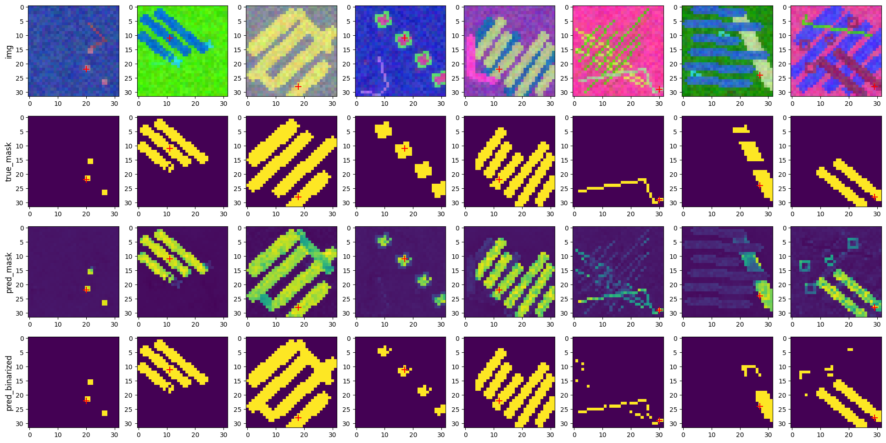
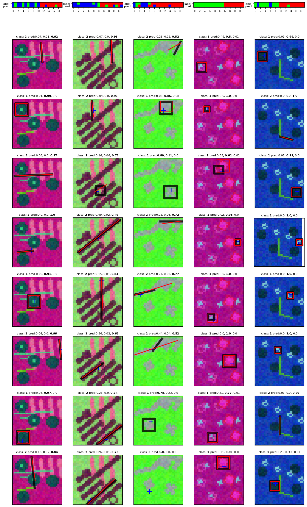
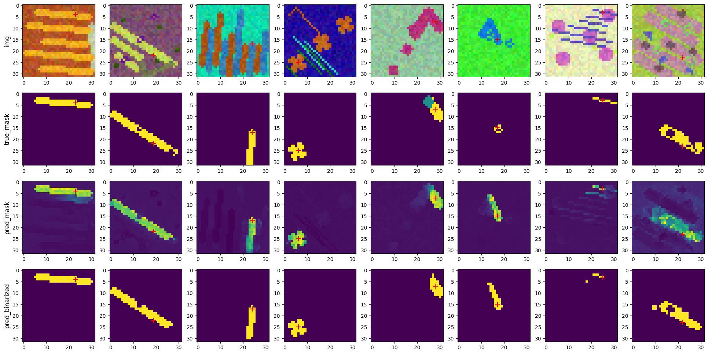

# Radial Positional Encoding & Pixel Features

This document introduces radial relative positional encoding (RRPE) and how it improves attention over image pixels for geometric structures like lines and rings. It also summarizes empirical results comparing a base pixel features model against a radial-encoded variant and explains how the RRPE-enhanced architecture is built and why it helps.

Function and classes used to build models mentioned in this document can be found in [VecModels](./models_src/VecModels.py) module.

**Technological stack:**<br>
TensorFlow | Keras | NumPy | Matplotlib | math | SymPy

## Why radial relative encoding?

In many cartographic and geometric datasets, important structures (roads, rivers, boundaries) tend to be linear or radially organized around junctions and centers. Standard absolute positional encodings (Cartesian sinusoids over x/y) tell the model where a pixel is in the image, but not where a pixel is relative to the query token driving attention. RRPE shifts the frame of reference to polar coordinates centered at the query: angle (orientation) and radius (distance). This query-centric positional signal matches the geometry of the task, allowing attention to flow along lines, rays, and rings with less learning burden.

- Query-relative orientation and distance disentangle two key priors: “which direction” vs “how far.”
- Angular coherence along a line forms a strong prior that helps the model track strokes through gaps and noise.
- Radial distance is translation-invariant after normalization, improving robustness across placements.

**Table of Contents:**
- [Base models](#base-models)
  - [Pixel features extraction](#pixel-features-extraction-link)
  - [Pixel similarity model](#pixel-similarity-model-link)
- [Radial Relative Positional Encoding](#radial-relative-positional-encoding-link)
  - [Radial-Encoding Pixel Features Model](#radial-encoding-pixel-features-model-link)
  - [RRPE Vector Detection Model](#rrpe-vector-detection-model-link)
  - [Pixel Similarity Shapes Model](#pixel-similarity-shapes-model-link)

## Base models

### Pixel features extraction [link](./Fourier/pixel_features_model.ipynb)
It is a `U-Net` based model with head layers responsible for estimation of specific pixel features like:
- class (line, rectangular/circular shape, background)
- thickness
- angle (for lines) - angle loss uses transformation of a vector estimation to angle value and then applies `two_side_angle_diff` function to calculate difference between predicted and true angles:
  ```python
  tf.math.atan2(*tf.split(inputs, 2, axis=-1))
  ```
  ```python
  def two_side_angle_diff(a, b, gamma=1.):
      return tf.abs(tf.sin(a-b))**gamma
  ```
- center vector - a vector representing direction and distance to the center of a shape or a line going through the center of a linear shape

It is mostly used as a backbone model. Because output features are highly focused on recognition of spatial dependencies that are crucial for vectors recognition, it is a great embedding base for any object detection model working on the same dataset.
In addition, center vectors were used for more efficient selection of reference points in various of models.

During training, loss for features like thickness, angle and center vector is calculated using weight maps so that only pixels that are relevant to a specific feature contribute to the loss.


---

### Pixel similarity model [link](./Fourier/pixel_similarity_model.ipynb)
Another model which can serve as a backbone. It is built on top of `Pixel Features` model with additional color embeddings. The output of the model is a [B,N,N] tensor, where B is a batch size, N is a number of pixels in the image (H*W). Each [N,N] matrix represents similarity between each pair of pixels in the image. The similarity is calculated as a dot product between L2-normalized feature vectors extracted for each pixel.

Model trained to focus on only pixels that belong to the same pattern is especially useful for attention-based models, where attention layers will work well starting from the first iteration.

#### Loss Function
The `WeightedPixelCrossSimilarityCrossentropy` class is a specialized loss function for semantic segmentation and feature clustering. It departs from standard point-wise classification by evaluating the **relational topology** of the prediction, forcing the model to optimize how pixels relate to one another within a global context. This loss function transforms a standard segmentation task into a **Similarity Learning** problem. Instead of comparing a pixel's predicted class directly to a label, it constructs an affinity graph to determine if "like pixels" are correctly grouped together.

- **Relational Affinity Mapping**
The function projects the ground truth labels into a higher-dimensional relational space using a matrix transpose multiplication. This produces an $HW \times HW$ matrix where each entry represents the relationship between pixel $i$ and pixel $j$. A value of $1$ indicates the pixels share a class, while $0$ indicates they do not. This encourages the model to learn spatial and semantic cohesion.
$$y_{relational} = y_{true}^T \times y_{true}$$

- **Dynamic Class-Density Balancing**
To address class imbalance without manual weight tuning, the function calculates inverse-frequency weights dynamically:
    1. **Pattern Summation:** Aggregates the total spatial footprint of each class.
    2. **Area Normalization:** Scales the labels by the inverse of their area ($y_{true} / \text{sums}$), ensuring small objects have a gradient impact equal to large background regions.
    3. **Spatial Weighting:** Distributes these importance scores back across the flattened spatial dimensions.

- **Similarity Cross-Entropy**
The final objective is computed via Binary Cross-Entropy (BCE) over the affinity matrices. By evaluating the probability of "attachment" between pixel pairs, the loss captures structural boundaries and intra-class consistency more effectively than standard Categorical Cross-Entropy.



<br><br>

## Radial Relative Positional Encoding [link](./Fourier/radial_relative_pos_enc.ipynb)


- **Core idea**
  - **Purpose and intuition**
    - Attention over image pixels benefits from position signals that are aligned with the target geometry. Absolute Cartesian sinusoids encode where a pixel is in the image, but not where it is relative to the query token that drives attention. For linear and radially organized structures (lines, rays, circles, star junctions), a query-centric polar frame makes the geometry simple: points on the same line through the query share the same angle, and their distance grows monotonically along the line.
    - Radial Relative Positional Encoding (RRPE) encodes each pixel p relative to a query/reference pixel q in polar coordinates. It factors the relative vector Δ = p − q into angle θ = atan2(Δy, Δx) and radius ρ = ||Δ|| (optionally normalized), and maps (θ, ρ) to a compact feature vector φ(p | q). This vector serves as a learned, query-conditional positional bias for attention.
  
  - **Formulation**
    - Let tokens be pixels on an H×W grid. For a query pixel qi at position pi and a key pixel kj at position pj:
      - Δij = pj − pi, θij = atan2(Δy, Δx), ρij = ||Δij|| / Rmax (clamped to [0, 1], with Rmax ≈ √(H²+W²)).
      - RRPE builds φ(θij, ρij) either with smooth sector/ring channels or multi-frequency sin/cos (see “Encoding variants” below).
      - In an attention head h, the positional bias is bh(i, j) = wh^T φ(θij, ρij). The attention logits become:
        - scoreh(i, j) = (qi · kj) / √d + bh(i, j) + Mh(i, j), where M is an optional mask/gate.
      - This adds a geometry-aware, query-relative term that prefers pixels at compatible angles/radii with respect to the query.
  
  - **Why it helps attention follow linear shapes**
    - Angular coherence along a line: For a line passing through the query, θ is nearly constant (two antipodal modes for opposite directions). RRPE creates channels that spike for that θ, so attention naturally concentrates along the line with minimal learning burden.
    - Monotonic distance: Along a line, ρ changes smoothly. The model can disambiguate the forward/backward ray or prefer a neighborhood band around the query (thickness control) by weighing ρ channels.
    - Parallel-line disambiguation: Near-parallel structures with different offsets have similar θ but distinct ρ patterns relative to the query. RRPE lets attention pick the correct line via radial gating rather than relying on content alone.
    - Junction handling: At T/X junctions, θ becomes multi-modal. Different heads can specialize to different angular lobes; RRPE provides clean, separable modes in angle space without requiring deep stacks to discover them.
    - Robustness to gaps and noise: Because the positional prior is continuous in θ, attention can bridge small breaks in stroke continuity and remain aligned even when content cues are weak.
    - Rotation and translation resilience: θ is rotation-aware and ρ is translation-invariant (after normalization). Models trained with RRPE generalize better across orientations and placements without extensive augmentation.
  
  - **Integration pattern**
    - A radial encoder (e.g., RSFE layer) produces per-pixel polar features φj = φ(pj | qi) for each key relative to the current query. A small learned projection per head turns φj into a scalar bias bh(i, j) that is added to the attention logits.
    - An optional soft mask Mh(i, j) gates by locality or by learned relevance. In the notebook, we expose:
      - pos_enc: the RRPE feature map channels for all pixels,
      - attn_mask: a head-specific gate,
      - learned_pos_map: a visualization obtained by contracting attn_mask with pos_enc, which highlights the angular–radial band aligned with the target line through the query.
    - This design is drop-in for standard MHA: keys/values remain content features; RRPE contributes a relative geometric prior per head.

- **Encoding variants**
  - Separate (clock + ring)
    - Angle: split 360° into sectors and produce smooth one-hot-like channels per sector.
    - Distance: split radii into rings and produce smooth one-hot-like channels per ring.
    - Concatenate angle and distance channels to form the embedding.
  - Frequency (sin/cos)
    - Apply multi-frequency sine/cosine to angle and to distance (log-spaced frequencies).
    - Concatenate [sin(angle), cos(angle), sin(radius), cos(radius)] channels for a compact, continuous embedding.

- **Comparison against Cartesian sine encoding**
  - Baseline: absolute SinePositionEncoding on (x, y) (no query-relative information).
  - Dataset: synthetic images with lines; the task is to predict line endpoints given a query point on the line.
  - Results: both radial variants achieve consistently lower validation loss over 20 epochs than the baseline; attention maps concentrate along the target line from the query; the frequency-based variant performs best overall.

- **Key advantages of radial relative encodings**
    - Geometry-aligned inductive bias: encoding in a query-centric polar frame makes lines, rays, circles, and junctions linear/separable in feature space, unlike absolute Cartesian sinusoids.
    - Factorized priors: decouples orientation (angle) from scale/proximity (radius). Angle channels are rotation-aware; radius channels are translation- and rotation-invariant, improving generalization.
    - Continuous multi-scale fields: the frequency variant yields smooth, compact embeddings over angle/radius, supporting precise localization and stable interpolation with fewer channels.
    - Drop-in design: same interface as standard sine encodings in attention blocks; selectable separate/frequency variants without architectural changes.

### Radial-Encoding Pixel Features Model [link](./Fourier/radial_enc_pixel_features.ipynb)

#### Comparison table: U-Net vs RRPE variant

This table summarizes validation metrics for the standard pixel features model and the RRPE-enhanced variant. The RRPE (Radial Relative Positional Encoding) model shows consistent improvements in all feature-related losses (shape class, angle, thickness, center vector). The slightly higher inference time reflects the added positional encoding and attention computations, which trade a modest runtime increase for better geometric alignment and accuracy.

| Model | val_shape_class_loss | val_angle_loss | val_thickness_loss | val_center_vec_loss | Inference time |
|------|-----------------------|----------------|--------------------|---------------------|----------------|
| U-Net pixel features | 0.0699 | 0.0922 | 0.2674 | 0.2075 | 14 ms/step |
| RRPE pixel features | 0.0335 | 0.0741 | 0.2087 | 0.1805 | 22 ms/step |

<br>

#### Architecture overview [radial_enc_pixel_features_model_generator](./Fourier/model_generators/radial_enc_pixel_features.py)

The RRPE-enhanced pixel features model keeps the familiar input and output interface of the base model while inserting geometry-aware components in the middle. Below is a walkthrough of the data flow and the purpose behind each stage.

- Inputs and backbone
  - Two operating modes:
    - Colors-only: the model consumes raw RGB images and applies BatchNormalization to standardize inputs. This lightweight path is useful when an external backbone is unnecessary.
    - Backbone mode: a pretrained backbone provides two tensors: a high-level feature map ("memory") capturing semantic context, and an early-layer normalized map ("normed_img") retaining color/texture detail. This split lets us fuse semantics with color cues downstream.

- Coordinates and RRPE
  - YXcoordsLayer generates per-pixel coordinates over the H×W grid.
  - A radial encoder (SeparateRadialEncoding or FrequencyRadialEncoding) converts each pixel’s position into query-relative angle and radius features. In practice, for each attention head, these features act as learned positional values that bias attention toward pixels aligned with the query’s geometric direction.

- RadialSearchFeaturesExtraction (RSFE)
  - The RSFE block builds embeddings for attention:
    - Color stream: a small FFN transforms the normalized image features into compact color embeddings, capturing local appearance relevant to strokes.
    - Memory stream: when available, another FFN processes backbone features to provide semantic context.
    - Fusion: the two streams are concatenated and projected by an FFN, then SqueezeImg flattens them into a token list so attention can operate over pixels.
  - Positional encodings are similarly squeezed to match the token layout.

- SelfRadialMHA blocks (attns_num stages)
  - Each stage applies multi-head attention, but instead of using content features as values, it contracts attention weights with RRPE positional values. This produces outputs that are geometry-aligned to the query direction and distance.
  - Progressive scaling (optional) increases the number of heads and embedding dimensions in deeper stages to capture more complex angular/radial patterns.
  - Residual AddNorm and FFNs refine the representation; the first stage decodes directly from attention output to seed strong geometric features early.

- Optional memory concatenation
  - If enabled, squeezed backbone memory is concatenated with features before the output head, injecting extra semantic context.

- Output heads
  - A final FFN produces 8 channels, reshaped to [H, W, 8]. SplitLayer divides them into four targets: shape_class (3), angle (2), thickness (1), center_vec (2).
  - Activations: softmax for shape_class, a vector-to-angle activation for angle, and identity for thickness and center_vec. These choices preserve continuous geometry where needed and enforce categorical behavior for classes.

- Why this architecture works
  - By combining appearance (color), semantics (memory), and query-relative geometry (RRPE) inside attention, the model receives strong priors about where to look next along a stroke. This reduces ambiguity at junctions, bridges gaps, and stabilizes local measurements like thickness and center direction, leading to the improvements shown in the comparison table.

---

### RRPE Vector Detection Model [link](./Fourier/radial_enc_vec_detection.ipynb)

This section describes a sample-centric vector detection architecture that uses Radial Relative Positional Encoding (RRPE) to predict per-sample vectors (e.g., line segments) and classes with optional thickness. The model aligns attention with geometry around selected sample points, enabling robust decoding of vector endpoints even through gaps and at junctions.

**Architecture overview** [radial_enc_vec_detection_model_generator](./Fourier/model_generators/radial_enc_vec_det.py#L7)

#### What problem it solves
Given an image and a set of sample points (S per image), the model predicts, for each sample, a small set of vector elements:
- Two endpoints (absolute pixel coordinates) of a local segment anchored at the sample.
- A class distribution (e.g., line/background/other).
- Optional thickness per sample.

By centering positional encoding on the sample points, attention gains a strong prior to look along rays and rings around each sample, which stabilizes orientation, extent, and class decisions.

#### High-level data flow
- Backbone features
  - A backbone provides two tensors: memory (semantic features) and normed_img (early normalized map). If memory is 3D, it is unsqueezed to [B, H, W, C].
- Sample inputs
  - A tensor of sample coordinates of shape [B, S, 2] is provided as an input (sample_points).
- RRPE around samples
  - For each sample, RRPE builds angle/radius features for all pixels. Two variants are supported:
    - Separate (clock + ring) or
    - Frequency (sin/cos), the default in code paths labelled "Freq".
- Feature preparation
  - SampleRadialSearchFeaturesExtraction fuses memory + color streams via FFNs, extracts features at sample points, and produces:
    - features: flattened per-pixel tokens for the full image (values/keys in attention),
    - sample_features: per-sample tokens (queries),
    - pos_enc: per-pixel RRPE aligned to the sample batch.

#### Core attention stages
- DetectionMHA (sample queries → image features)
  - Queries: sample_features; Keys/Values: features; Positional enc: pos_enc.
  - Modes:
    - key_pos_enc: add RRPE to K from the 2nd block onward,
    - value_pos_enc: add RRPE to V (enabled if pos_enc_matmul is False),
    - query_pos_enc: optional addition to Q,
    - pos_enc_matmul: optionally add a learned Dense projection of (weights × pos_enc) to the output, letting the model fuse an aggregated geometric field.
  - Returns x plus weights/scores; residual AddNorm updates sample_features.

- Optional sample self-attention (queries_self_attn)
  - Uses SampleFrequencyRadialEncoding (or Separate) over pairwise sample-to-sample deltas. Values can be either positional encodings (queries_pos_enc_values=True) or the recent content features. Another DetectionMHA block aligns interactions across samples (e.g., multi-stroke junctions), followed by AddNorm.

- Optional cross attention from global features (source_query_cross_attn)
  - ExpandedQueriesMHA lets global features query sampled features with queries enriched by positional encodings. The result is fed back into features with AddNorm, improving the shared context seen by all samples.

- Optional query expansion and message passing (sample_queries_num)
  - QuerySamplingLayer predicts K extra query points around each sample (relative offsets).
  - SampleFrequencyRadialEncoding builds sample→query RRPE for those offsets.
  - SampleQueryExtractionLayer bilinearly interpolates global features at query points.
  - SampleQueryMessagePassing integrates those query-aligned features into sample_features via a gated FFN and LayerNorm, refining local evidence around the sample.

- Optional feature updates (features_update)
  - QuerySamplesFeaturesMHAUpdate fuses attention scores from DetectionMHA back into features, then a decoder FFN + AddNorm update the global feature tokens, improving subsequent blocks.

Each block ends with a decoder FFN and residual AddNorm over sample_features to consolidate newly gathered evidence.

#### Positional encoding details for detection
- SampleFrequencyRadialEncoding computes angle θ and normalized distance ρ between two sets a and b (e.g., samples a and queries b), with controllable broadcasting (expand_a, expand_b). For non-inverted angles, θ is shifted by π; distances can be scaled (×2) before multi-frequency sin/cos is applied to both θ and ρ, then concatenated.
- In DetectionMHA, RRPE can be added to Q, K, V. This can bias matching (K), inject geometric value content (V), or prime queries (Q). With pos_enc_matmul, a learned projection of (weights × pos_enc) adds a second geometric pathway into the head output.

#### Head and outputs
- SampleRadialSearchHead decodes per-sample predictions from sample_features:
  - Vectors: either as two endpoints (reshape to [S, 2, 2]) or via angle+length decoding (AngleLengthVecDecoder) if angle_based_preds=True. Predicted offsets are added to the sample coordinates to yield absolute positions.
  - Classes: a 3-way softmax over [S, 3].
  - Thickness (optional): a scalar per sample [S, 1].
- The model returns a dictionary of tensors: {"vecs": ..., "class": ..., optional "thickness"}.

#### Configuration knobs (mapping to generator arguments)
- enc_type: "separate" or frequency (default) RRPE.
- num_heads, embs_dim, color_embs_dim: attention width and feature composition.
- size: input spatial size (assumes square H = W = size).
- sample_points: number of per-image samples S.
- embs_mid_layers, out_mid_layers, activation, dropout: FFN depths and nonlinearity.
- attns_num: number of detection blocks.
- pos_enc_matmul: enable the learned (weights × pos_enc) projection path.
- queries_self_attn: enable sample-to-sample attention; queries_pos_enc_values toggles using RRPE as values for that self-attn.
- source_query_cross_attn: enable global-features-as-queries cross-attn to sample features.
- sample_queries_num: predict and integrate K additional query points per sample.
- angle_based_preds: decode vector via angle/length rather than direct endpoints.
- thickness_pred: predict per-sample thickness.
- features_update: update global features using attention scores and decoder FFN.
- backbone_*: configuration of the feature backbone and trainability.

#### Why it works for vector detection
- Sample-centric geometry: RRPE aligns attention with rays and rings centered at each sample, so the model quickly locks onto the stroke passing through the point and infers plausible endpoints.
- Local–global fusion: content features from the global grid, plus positional values and optional cross-attn, balance context and local precision.
- Robust to clutter and gaps: the angular/radial prior stabilizes endpoint regression where content alone is ambiguous, especially at junctions and along faint or interrupted lines.



---

### Pixel Similarity Shapes Model [link](./Fourier/pixel_similarity_shapes_model.ipynb)

This model produces a per-image pixel–pixel dot-similarity matrix [N×N]. For any selected pixel (query), its similarity row (reshaped to H×W) acts as a soft shape mask, highlighting pixels that belong to the same object or stroke. RRPE drives attention in a query-centric polar frame, aligning embeddings along angles and radii so the mask remains coherent through gaps, at junctions, and across rotations.

**Architecture overview** [radial_enc_pixel_similarity_dot](./Fourier/model_generators/radial_enc_vec_det.py#L65)

- Inputs: RGB (colors-only) or backbone features + normalized image.
- RRPE variants: frequency (default) or separate; angle inversion optional.
- Core flow: RSFE builds tokens → SelfRadialMHA uses RRPE → FFNs → Q/K → L2‑normalized dot similarity.
- Usage: pick a seed pixel i (y*W+x), take similarity[i], reshape to H×W, threshold for a binary mask.
- Benefit: geometry-aligned similarity that cleanly groups pixels of the same shape and suppresses distractors/parallel lines.



