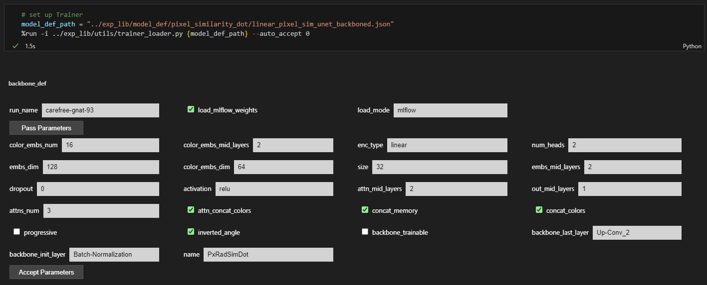

# Experiment Tracking Library (`exp_lib`)

The **Experiment Tracking Library (`exp_lib`)** is a lightweight, modular MLOps framework built around TensorFlow/Keras and MLflow. It provides a fully configurable pipeline that takes you from synthetic dataset generation to model training, experiment tracking, metric validation, and result visualization—without hard‑coding model or dataset specifics in notebooks.

This document describes the architecture, workflow, and advanced features of `exp_lib`, using the **pixel features extraction** pipeline (`pixel_features_model.ipynb`) as a concrete example.

The `exp_lib` stack implements several advanced patterns that make it a practical, flexible MLOps framework:
1. **Strict separation of concerns**
    - Dataset configuration, model definition, loss/optimizer setup, and training loop are compartmentalized.
    - Notebooks act solely as orchestrators, making them easy to read and minimal to maintain.

2. **Declarative experiment specification**
    - Models are defined by small JSON files (`model_def/*.json`) pointing to generator and compiler functions with arguments.
    - Experiment‑level settings live in JSON (`general_config`, `msmg`), encouraging version control and review.

3. **Multi‑output, domain‑aware modeling**
    - Support for vector‑based tasks with specialized geometry‑aware losses and metrics.
    - Clean handling of multiple prediction heads and per‑head metrics.

4. **Reusable dataset infrastructure**
    - `DatasetGenerator` supports synthetic generation, TFRecord persistence, local/GCS storage, and dynamic preprocessing.
    - Same generator and MSMG configs can serve several models and research directions.

5. **Consistent MLflow integration**
    - Training, metric evaluation, and hyperparameter tuning are all MLflow‑aware.
    - Model definitions (architecture + compiler args) are logged as artifacts and can be fully reconstructed.
    - Helpers for downloading and caching models make it straightforward to reuse backbones across projects.

6. **Interactive but reproducible hyperparameter editing**
    - Widget‑based UI (`dict_widget`) for quickly adjusting JSON‑defined hyperparameters during prototyping.
    - Final configurations get captured through `model_def` upload to MLflow.

7. **Extensibility with minimal boilerplate**
    - To create a new pipeline, one typically needs only:
        - A new dataset generator script and MSMG/general config.
        - A new model definition JSON pointing to a generator function.
        - Optionally, a dedicated compiler module for custom loss/metric setups.
    - The rest of the infrastructure (trainer, MLflow integration, metric scripts) is reusable.

8. **Backbone‑centric workflows**
    - Trained models can be treated as backbones via `backbone_loader`, allowing transfer learning and modular architectures without re‑implementing loading logic.


---

## High‑Level Architecture

At a high level, `exp_lib` separates **configuration**, **data generation**, **model definition**, **compilation**, **training**, and **tracking** into distinct, composable components:

- **General configuration** (`general_config/*.json`)
  - Global experiment settings per pipeline (batch sizes, dataset paths, validation split, experiment name, etc.).
- **Dataset generators** (`datasets_generators/*.py`)
  - Orchestrate dataset loading / generation using configuration + synthetic map generators.
  - Produce train/validation/test `tf.data.Dataset` objects and iterators.
- **MSMG configuration** (`msmg/*.json`)
  - Detailed parameters for *MultishapeMapGenerator* (synthetic vector map generator).
- **Model definition** (`model_def/*.json`)
  - Fully describes a model in a **declarative** way: generator module/function and arguments, plus the compiler module and arguments.
- **Compilers** (`compilers/*.py`)
  - Translate configuration into concrete `model.compile(...)` arguments: optimizer, structured multi‑output loss, metrics, and loss weights.
- **Training utilities** (`utils/*.py`)
  - `trainer_loader.py` – bootstraps a `TrainingProcessor2` trainer from a model definition and an already‑prepared dataset.
  - `dict_widget.py` – interactive notebook widgets for editing model hyperparameters.
  - `cfg_loader.py` – minimal JSON→object loader for configs.
  - `load_mlflow_model.py` – MLflow‑aware model loading, caching, and backbone reuse utilities.
  - `namespace.py` – small helper for checking required variables.
- **MLflow integration** (`mlflow/local_experiment.py`)
  - Centralizes MLflow experiment setup and autologging configuration.
- **Metric validation** (`metric_validation/*.py`)
  - Offline evaluation scripts that compute structured metrics over test sets and push results to MLflow.
- **Plots** (`plots/*.py`)
  - Reproducible visualization scripts for qualitative inspection.
- **Training processors** (outside `exp_lib`)
  - `TrainingProcessor` and `TrainingProcessor2` (in `models_src/Trainer.py`) encapsulate training loops, MLflow logging, hyperparameter tuning integration, and artifact management.
  - `BuildHyperModel` (in `models_src/Trainer_support.py`) provides a KerasTuner‑driven hyperparameter search that is MLflow‑aware.

The **key design idea** is that the notebook becomes only a thin orchestrator, while all experiment structure, hyperparameters, and logging behavior are defined in reusable, version‑controlled configuration and library code.

---

## End‑to‑End Workflow (Pixel Features Example)

The `Fourier/pixel_features_model.ipynb` notebook demonstrates how `exp_lib` is used in practice. The typical workflow consists of the following steps:

1. **Import runtime dependencies** and reload development modules (for iterative work).
2. **Configure dataset generation** using `general_config/pixel_features.json` and `datasets_generators/pixel_features.py`.
3. **Configure MLflow experiment** via `mlflow/local_experiment.py`.
4. **Load trainer and model definition** using `utils/trainer_loader.py` and `model_def/unet_pixel_features.json`.
5. **Train the model** with `TrainingProcessor2.train_model` and MLflow logging.
6. **Upload weights / model definition to MLflow** (if needed explicitly).
7. **Reload a model from MLflow** with `utils/load_mlflow_model.py` for downstream tasks.
8. **Run metric validation** (`metric_validation/unet_pixel_features.py`) and send metrics to MLflow.
9. **Run plotting utilities** (`plots/unet_pixel_features.py`) for visualization.

The notebook is therefore a *pipeline driver* that sequences:

```text
config → dataset generator → trainer + model definition → training + MLflow
        → metrics + MLflow     → plots / downstream usage
```

All crucial decisions (dataset, model topology, loss functions, metrics, optimizer, experiment name) are **externalized** into JSON and Python config units, enabling easy reuse across models and experimentation contexts.

---

## Configuration‑Driven Dataset Generation

### General Dataset Configuration

File: `exp_lib/general_config/pixel_features.json`

```json
{
  "train_batch_size": 32,
  "val_batch_size": 64,
  "test_batch_size": 8,
  "ds_path": "../Fourier/datasets/pixel_similarity",
  "experiment_name": "pixel_features_extraction",
  "msmg_config_path": "../exp_lib/msmg/pixel_similarity.json",
  "val_idxs": [0],
  "shuffle_buffer_size": 128
}
```

This file controls **global training behavior** for the pixel features experiment:

- Batch sizes per split.
- Dataset storage location (`ds_path`) – TFRecords are saved/loaded from here.
- MLflow experiment name to register runs under.
- MSMG configuration path for synthetic data parameters.
- Validation fold indices and shuffle buffer size.

Configuration is parsed by `cfg_loader`:

```python
class cfg_loader:
    def __init__(self, cfg_path):
        with open(cfg_path) as json_cfg:
            ds_cfg = json.load(json_cfg)
        self._add_attributes(**ds_cfg)
```

This creates a **structured config object** `cfg` where JSON keys become attributes, giving static‑like access without additional boilerplate.

### MSMG (Multishape Map Generator) Configuration

File: `exp_lib/msmg/pixel_similarity.json`

This JSON describes the parameters for synthetic vector map generation via `MultishapeMapGenerator`:

- Output names and shapes (`outputs`).
- Patch size (`size`).
- Number of patterns / shapes per patch.
- Randomization ranges (thickness, sizes, spacing, angles, distances, etc.).
- Probabilities for pattern types (lines, double lines, polylines, spreaded shapes, etc.).
- Arguments for specific pattern generation strategies (`line_args`, `shape_args`, `line_filled_args`, `polyline_args`, ...).

This level of detail enables **highly controllable synthetic data generation**, covering geometry, noise, and pattern diversity.

### Dataset Generator Script

File: `exp_lib/datasets_generators/pixel_features.py`

This script is executed from the notebook via:

```python
config_path = "../exp_lib/general_config/pixel_features.json"
%run -i ../exp_lib/datasets_generators/pixel_features.py {config_path}
```

Responsibilities:

1. **Load general config**:
   - `cfg = cfg_loader(ds_cfg_path)`
2. **Load MSMG config** and instantiate `MultishapeMapGenerator`:
   - `msmg = MultishapeMapGenerator(**msmg_config['msmg'])`
3. **Instantiate dataset generator** `DatasetGenerator` from `models_src.VecDataset`:
   - Passes `map_generator=msmg`, `ds_path`, fold size and generator settings from `msmg_config['dg']`.
   - Enables parallel generation (`parallel_calls=4`).
   - Uses **padded batching** and **filtered outputs** to control which keys are exposed to the model.
   - Attaches **pre‑processing functions** (`blur_img`, `op_line_features`) in a composable way.
4. **Construct datasets**:
   - `ds`, `train_steps` – training dataset (optionally from saved TFRecords) with shuffling.
   - `val_ds`, `val_steps` – validation dataset filtered by `val_idxs`.
   - `test_ds`, `test_steps` – test dataset.
5. **Expose iterators** (`ds_iter`, `val_iter`, `test_iter`) for debugging and metric scripts.

Because everything is parameterized through JSON and the `cfg_loader`, the same generator pattern can be reused across **many model pipelines** by simply pointing to different config files.

### DatasetGenerator Features

Although the full implementation resides in `models_src.VecDataset`, the provided `DatasetGenerator` class illustrates several advanced pipeline features:

- **On‑the‑fly vs. TFRecord‑backed datasets**:
  - `_new_dataset` generates samples on the fly using `tf.data.Dataset.range` and a `tf.numpy_function` wrapper around `map_generator`.
  - `_load_dataset` reads from TFRecord files with configurable validation fold selection.
- **Static shape annotation** for efficient graph tracing (`_set_shapes`).
- **Output filtering** so models only receive the necessary keys (`_filter_outputs`).
- **Named output mapping** from positional tensors to dicts aligned with generator output names (`_map_names`).
- **Composable pre‑processing pipeline**:
  - Accepts a list of `(func, kwargs, if_validation)` tuples.
  - Applies these functions as additional `ds.map` transforms, conditional on whether the dataset is a validation split.
- **Serialization helpers** for TFRecords:
  - `serialize_example`, `_gen_feature_description`, `_parse_function` manage (de)serialization of arbitrarily typed tensors.
- **Local/remote storage support via Google Cloud Storage**:
  - `upload_dataset_to_storage`, `download_dataset_from_storage`, `delete_bucket` allow pushing/pulling dataset shards to/from GCS.
- **Performance utilities**:
  - `dataset_speed_test` for runtime benchmarking.
  - Optional `padded_batch` configuration to support variable shapes.

Overall, the dataset component acts as a flexible **data pipeline abstraction** that can be configured purely from JSON to generate, persist, and load complex synthetic or real datasets.

---

## Declarative Model Definition and Compilation

### Model Definition JSON

File: `exp_lib/model_def/unet_pixel_features.json`

```json
{
  "model_args": {
    "input_shape": [32, 32, 3],
    "init_filters_power": 6,
    "levels": 3,
    "level_convs": 3,
    "init_dropout": 0.0,
    "dropout": 0.3,
    "batch_normalization": true,
    "name": "PxFeaturesUnet"
  },
  "generator_module": "Fourier.model_generators.pixel_features_unet",
  "generator_func_name": "pixel_features_unet",
  "compiler_func": "exp_lib.compilers.unet_pixel_features",
  "compiler_func_args": {
    "gamma": 1.0,
    "angle_gamma": 1.0,
    "length_gamma": 1.0,
    "dist_gamma": 2.0,
    "angle_weight": 0.3,
    "length_weights": 0.7,
    "dist_weight": 1.0,
    "loss_weights": {
      "shape_class": 0.25,
      "angle": 0.25,
      "thickness": 0.25,
      "center_vec": 0.25
    }
  }
}
```

Key ideas:

- The **model topology** is defined outside code via `generator_module` + `generator_func_name` + `model_args`.
- The **compilation recipe** is decoupled as `compiler_func` + `compiler_func_args`.
- This model definition is **logged to MLflow** (via `TrainingProcessor2.upload_model_def_to_mlflow`) and can be **downloaded later**, enabling exact reconstruction of past experiments.

### Compiler Module: Multi‑Head Loss and Metrics

File: `exp_lib/compilers/unet_pixel_features.py`

This compiler exposes a single `get_compile_args` factory that returns a dictionary directly consumable by `tf.keras.Model.compile`:

```python
def get_compile_args(...):
    compile_args = {
        'optimizer': tf.keras.optimizers.Adam(1e-3),
        'loss': {
            'shape_class': tf.keras.losses.BinaryCrossentropy(...),
            'angle': AngleLoss(...),
            'thickness': tf.keras.losses.MeanAbsoluteError(...),
            'center_vec': AngleLengthLoss(...)
        },
        'loss_weights': loss_weights,
        'weighted_metrics': None,
        'metrics': {'shape_class': WeightedF12D()}
    }
    return compile_args
```

Advanced aspects:

- **Multi‑output model support**:
  - Each output head (`shape_class`, `angle`, `thickness`, `center_vec`) has its own **specialized loss**.
  - Custom losses `AngleLoss` and `AngleLengthLoss` encode domain‑specific geometry (e.g., angular differences, vector length, and distance penalties).
- **Per‑head weighting**:
  - `loss_weights` controls the relative contribution of each task.
- **Head‑specific metrics**:
  - E.g. `WeightedF12D` for shape classification.
- **Hyperparameterized compiler**:
  - `gamma`, `angle_gamma`, `length_gamma`, `dist_gamma`, etc. can be tuned either manually or via hyperparameter search.

Since the compiler is **imported dynamically** (by name) from the model definition JSON, any new model can define its own compiler module without changing the training frameworks or notebooks.

---

## Training Orchestration and MLflow Tracking

### TrainingProcessor2: Flexible Trainer

The modern training interface is `TrainingProcessor2` (in `models_src/Trainer.py`). It is designed to be **generic** and driven entirely by external config and callbacks.

Core responsibilities:

- Hold a **config object** `cfg` with experiment‑level parameters.
- Manage references to **training/validation datasets** plus their step counts.
- Register a **model generator** function dynamically (from any module) via `load_model_generator`.
- Provide methods to **compile**, **train**, **save**, and **reload** models with MLflow logging.

Key methods:

- `load_dataset(ds, train_steps, val_ds=None, val_steps=None)`
  - Attaches the already‑constructed `tf.data.Dataset`s prepared by the dataset generator script.
  - Computes `cfg.train_samples` and `cfg.val_samples` from steps * batch size for logging.

- `load_model_generator(model_generator)`
  - Registers an arbitrary callable that takes `model_args` and returns a `tf.keras.Model`.
  - Trainer remains agnostic to the concrete architecture implementation.

- `compile_model(model_args, optimizer, loss, metrics=None, weighted_metrics=None, loss_weights=None, ...)`
  - Instantiates the model using the registered generator and given `model_args`.
  - Compiles with multi‑output loss dictionaries, metrics, and optional weighted metrics.
  - Stores loss configs and model args for later MLflow logging.

- `train_model(epochs, log=True, callbacks=None, export_final_state=True, export_model=False, export_model_def=True, validation_freq=1)`
  - **Starts an MLflow run** if `log=True` (with proper handling of existing runs).
  - Injects `mlflow.keras.MlflowCallback` into the callback list for automatic metric logging.
  - Runs `model.fit` on the training and validation datasets.
  - After training:
    - Logs final epoch/index.
    - Logs configuration and loss parameters (`_log_mlflow_params`).
    - Optionally uploads final weights and model definition JSON as artifacts.
    - Optionally logs the full model with all custom objects.

- `upload_weights_to_mlflow(run_id=None)`
  - Saves weights to a temporary directory (`./final_state_temp/final_state.weights.h5`).
  - Logs them as MLflow artifacts.

- `upload_model_def_to_mlflow()`
  - Reconstructs the `model_def.json` from the trainer’s `cfg` and `model_args` and logs it as an artifact.

- `load_model(run_name, load_final_state=True)`
  - Searches MLflow runs by run name prefix.
  - Downloads and loads the model (via `mlflow.tensorflow.load_model`).
  - Optionally downloads and loads the final weights.
  - Restores `cfg`, `model_args`, and `loss_args` from MLflow run parameters.

This design gives **full experiment reproducibility**: given only a run name and the codebase, one can:

1. Load the exact same model weights.
2. Recover model hyperparameters and configuration.
3. Continue training or evaluate on new datasets.

### MLflow Experiment Setup

File: `exp_lib/mlflow/local_experiment.py`

```python
experiment_name = sys.argv[1]

mlflow.set_tracking_uri("http://localhost:5000")
mlflow.set_experiment(experiment_name)
mlflow.tensorflow.autolog(log_datasets=False, log_models=True, disable=True, checkpoint=False)
```

This script is run early in the notebook:

```python
%run -i ../exp_lib/mlflow/local_experiment.py {cfg.experiment_name}
```

It centralizes MLflow configuration:

- Sets the tracking server URI (local MLflow server).
- Ensures all runs from this notebook land under a specific **experiment name**.
- Prepares TensorFlow autologging (optionally disabled/enabled in different parts of the pipeline).

### Trainer Loader: Bridging Config to Trainer

File: `exp_lib/utils/trainer_loader.py`

This is a critical piece that ties together:

- The **dataset objects** (`ds`, `val_ds`, `test_ds`, `train_steps`, `val_steps`) prepared in the dataset generator script.
- The **model definition JSON** (either from a local file or from MLflow).
- The **trainer class** `TrainingProcessor2` and the global `mlflow` instance.
- Optional interactive parameter editing through Jupyter widgets.

Flow:

1. Parse CLI arguments (run via `%run -i trainer_loader.py <model_def_path>`):
   - `--run_name` – if given, download `model_def.json` from MLflow instead of a local file.
   - `--load_weights` – whether to download / load MLflow weights.
   - `--summary` – whether to print model summary after compile.
   - `--trainer_name` – name to register the created trainer under in the notebook (`trainer` by default).
   - `--auto_accept` – whether to immediately compile without interactive widget editing.

2. Resolve `model_def`:
   - Either from `download_mlflow_model_components` (MLflow) or from a local JSON file.

3. Ensure a global `cfg` class instance exists, then populate model generation/compile fields:

   ```python
   cfg.generator_module = model_def['generator_module']
   cfg.generator_func_name = model_def['generator_func_name']
   cfg.compiler_func = model_def['compiler_func']
   cfg.compiler_func_args = model_def['compiler_func_args']
   ```

4. Dynamically import generator and compiler:
   - `model_generator = getattr(import_module(cfg.generator_module), cfg.generator_func_name)`
   - `compile_args_gen = getattr(import_module(cfg.compiler_func), 'get_compile_args')`
   - `model_args = model_def['model_args']`

5. In `__main__` block (when run as a script):
   - Instantiate `TrainingProcessor2(cfg, mlflow_instance=mlflow)` and attach it globally under `trainer_name`.
   - Call `load_dataset(ds, train_steps, val_ds, val_steps)` using variables provided by the dataset generator script.
   - Register the model generator via `load_model_generator(model_generator)`.
   - If `load_weights` is true, compile and load weights from cache.
   - If `run_name` is present, attach current MLflow `run_id` using `get_mlflow_run_id_by_name`.
   - Otherwise, use `dict_widget.display_dict` to visualize and optionally edit `model_args` via interactive widgets before compiling.

The result is that, from the notebook’s perspective, **one line**:

```python
%run -i ../exp_lib/utils/trainer_loader.py {model_def_path}
```

produces a fully configured `trainer` object with dataset, model generator, and compilation function ready to go.

---

## Interactive Hyperparameter Editing with dict_widget

File: `exp_lib/utils/dict_widget.py`

`dict_widget` provides a small UI layer on top of Jupyter/ipywidgets to make **model hyperparameter editing** ergonomic and safe.

Key features:

- **Automatic widget creation** for flat dictionaries:
  - Bools → checkboxes.
  - Ints → `IntText` inputs.
  - Floats → `FloatText` inputs.
  - Strings → `Text` inputs.
- Support for **nested dictionaries** (recursively displaying them with titles).
- Dark‑mode‑friendly styling via custom CSS.
- Integration with `TrainingProcessor2`:
  - `display_dict` accepts `trainer` and `compile_args_func` arguments.
  - Upon clicking **“Accept Parameters”**, it updates the dict and, if a trainer is provided, compiles the model using the updated args.

This pattern makes `model_def/*.json` a **starting point** that can be quickly fine‑tuned interactively in notebooks, while still allowing reproducible export of final configurations into MLflow.


---

## MLflow Model Loading and Backbone Reuse

File: `exp_lib/utils/load_mlflow_model.py`

This module implements a **reproducible, cache‑aware mechanism** for loading trained models from MLflow and reusing them as backbones in new experiments.

Capabilities:

- **Model cache management**:
  - `get_model_cache_info(run_name, dst_path)` checks whether a given run’s model definition and weights exist in a local cache directory (default `../model_cache/<run_name>`).
  - If missing, it resolves MLflow `run_id` and flags which artifacts need to be downloaded.

- **Artifact download helpers**:
  - `download_model_def` → downloads `model_def.json` artifact.
  - `download_model_weights` → downloads `final_state.weights.h5` artifact.

- **Composite download functions**:
  - `download_mlflow_model_components(run_name, load_weights=True, dst_path=...)`
    - Ensures the cache directory exists and downloads missing components.
    - Returns the `model_def` dict.
  - `download_mlflow_model_weights(run_name, dst_path=...)`
    - Downloads weights only and returns the local path.

- **Model reconstruction**:

  ```python
  def load_mlflow_model(run_name, load_weights=True, compile=False, dst_path='../model_cache'):
      model_def = download_mlflow_model_components(...)
      model_generator = getattr(import_module(model_def['generator_module']), model_def['generator_func_name'])
      model = model_generator(**model_def['model_args'])
      if load_weights:
          model.load_weights(os.path.join(dst_path, run_name, 'final_state.weights.h5'))
      if compile:
          compile_args_gen = getattr(import_module(model_def['compiler_func']), 'get_compile_args')
          compile_args = compile_args_gen(**model_def['compiler_func_args'])
          model.compile(**compile_args)
      return model
  ```

  - Precisely re‑creates the model architecture from its logged generator spec.
  - Optionally compiles it with the exact same loss/optimizer/metrics as during training.

- **Backbone loader**:

  ```python
  def backbone_loader(..., load_mode='mlflow', **kwargs):
      if load_mode == 'mlflow':
          backbone = load_mlflow_model(...)
      elif load_mode == 'local':
          generator = getattr(import_module(backbone_generator), generator_func_name)
          backbone = generator(**backbone_args)
          if weights_path is not None:
              backbone.load_weights(weights_path)
  ```

  This enables a trained model to be reused as a **frozen or fine‑tunable backbone** in downstream tasks, using either MLflow artifacts or local files.

Taken together with `TrainingProcessor2.upload_model_def_to_mlflow`, this provides a clean **round‑trip**:

```text
train + log → model_def.json + weights in MLflow → download + reconstruct
```

---

## Metric Validation and Plotting

### Metric Validation

File: `exp_lib/metric_validation/unet_pixel_features.py`

This script encapsulates **post‑training evaluation** using the same dataset pipeline but outside the training loop:

- Defines metric wrappers (`LossBasedMetric`) and custom angle/length metrics.
- Builds a `tf.function` (`tf_eval`) that calls `trainer.model` in inference mode and updates metrics using per‑output weights.
- Iterates over `test_iter` for `test_steps` with a TensorFlow progress bar.
- Computes a **weighted aggregate loss** and prints it.
- Optionally logs all metrics to MLflow under the corresponding `run_id`.

Executed from the notebook as:

```python
%run -i ../exp_lib/metric_validation/unet_pixel_features.py --upload=1
```

This keeps metric computation scripts **decoupled** from the training loop and tightly integrated with MLflow for traceability.

### Plotting

File: `exp_lib/plots/unet_pixel_features.py` (not shown in full)

Plot scripts typically:

- Reuse `trainer`, `ds_iter` and auxiliary utilities.
- Render prediction overlays, vector fields, or other domain‑specific visualizations.
- Are executed from the notebook via simple `%run` commands, keeping visualization code versioned and reusable.

---

## Hyperparameter Tuning Infrastructure

Even though the pixel features example uses a fixed model definition, the library includes support for **hyperparameter optimization** via KerasTuner integrated with MLflow.

### BuildHyperModel

File: `models_src/Trainer_support.py`

`BuildHyperModel` is a `kt.HyperModel` implementation that:

- Receives a base `model_func` and hyperparameter specification dicts for:
  - Model arguments (`model_hp`).
  - Optimizer args (`optimizer_hp`).
  - Loss args (`loss_hp`).
  - Metric args (`metrics_hp`).
- Converts these specs into KerasTuner objects or fixed values via `_format_hypermatameters`.
- Defines `build(hp)` to:
  - Generate a model with tuned hyperparameters.
  - Compile it with tuned optimizer, loss, and metrics.
- Overrides `fit` to:
  - Inject additional callbacks (also hyperparameterized).
  - Optionally log each trial to MLflow with full hyperparameter sets.

### Tuner Construction in TrainingProcessor

The legacy `TrainingProcessor.build_tuner` method wires `BuildHyperModel` into a KerasTuner tuner instance, enabling **joint tuning of model, optimizer, loss, and callbacks** while optionally recording trial details in MLflow.

This creates a scalable framework for **searching over complex multi‑output architectures** and training setups, beyond the simple single‑run pattern.

