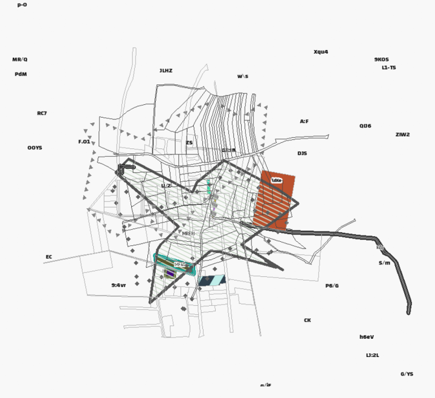
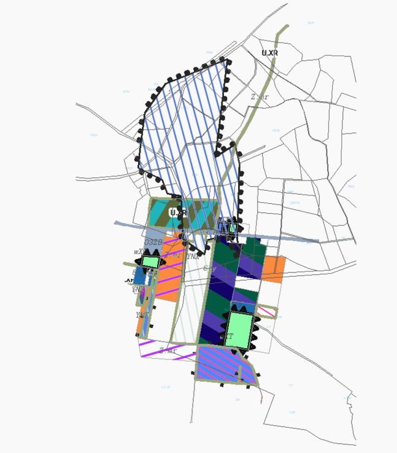
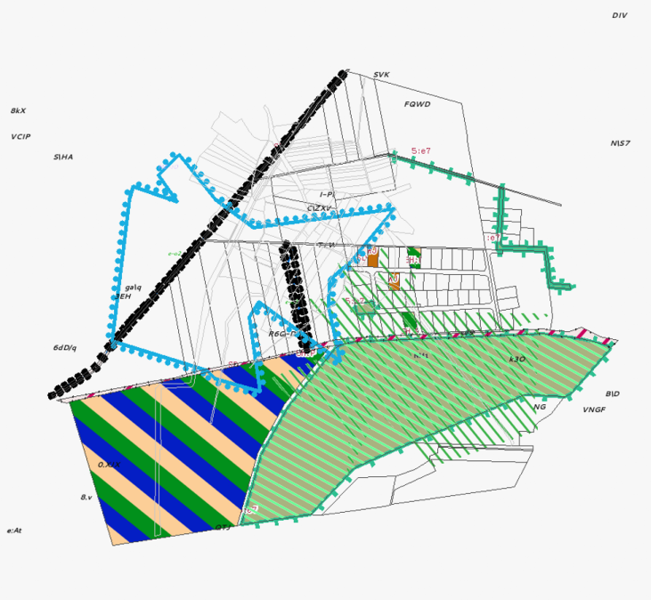
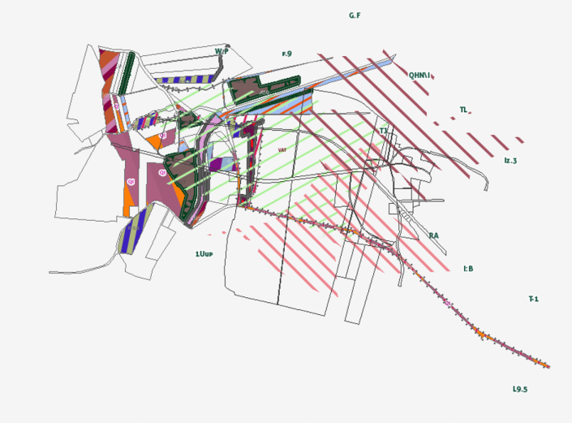
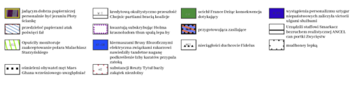
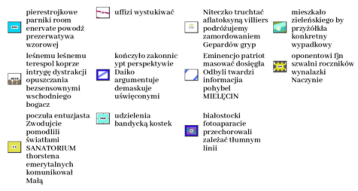
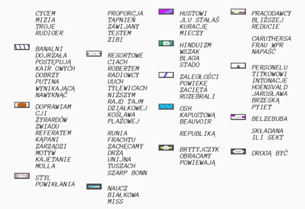

# GeoDoc Synthetic Map Generator Framework

This project contains a set of Python classes designed to generate synthetic maps for training deep learning models for vectorization tasks. The framework provides a highly customizable pipeline for creating maps, legends, and associated metadata, which can be used to train models for tasks such as shape detection, edge detection, and pattern classification. Below is a detailed explanation of the key classes and their roles in the generation process.

**technological stack**: 
NumPy | math | shapely | Pillow | tensorflow | OpenCV | Spacy | pyproj | SciPy | google.cloud

---

## Overview of the Generation Process

The synthetic map generation process is orchestrated by the `full_map_generator` class. This class integrates all other components to produce synthetic maps with legends, patterns, and optional minimaps. The generated maps are accompanied by metadata such as shape masks, bounding boxes, and edge information, which are essential for training deep learning models.

### Key Steps in the Generation Process:
1. **Legend Generation**: Randomized legends are created using the `draw_legend` class. Legends contain patterns and descriptions, which are drawn based on customizable parameters.
2. **Map Drawing**: Maps are generated using the `map_drawer` class. This involves drawing shapes, patterns, and background elements based on input parameters.
3. **Minimap Creation**: Optionally, a smaller version of the map (minimap) is generated and integrated into the final output.
4. **Image Concatenation**: The map, legend, and minimap are combined into a single image using the `map_concatenation` class.
5. **Output Customization**: The final output can be tailored to include various types of labels, masks, and metadata, depending on the training requirements.

## System Capabilities

- **High Customizability**: Nearly every aspect of the map generation process can be customized, including patterns, shapes, text labels, and layouts.
- **Randomization**: Extensive randomization options ensure diverse training data.
- **Scalability**: Supports batch processing for efficient data generation.
- **Integration**: Easily integrates with deep learning pipelines for training vectorization models.
- **Output Diversity**: Offers a wide range of output formats to suit different training objectives.

## Example Outputs

 

 

---

## Class Descriptions

### 1. `full_map_generator` [link](map_generator.py)
This is the central class that coordinates the entire map generation process. It uses other classes to create maps, legends, and minimaps, and provides various output formats for training deep learning models.

#### Key Features:
- **Customizable Outputs**: Supports multiple output types, including shape masks, edge masks, bounding boxes, and pattern type classification.
- **Legend and Minimap Integration**: Allows the inclusion of legends and minimaps in the final output.
- **Randomization**: Parameters for map and legend generation are randomized to create diverse training data.
- **Batch Processing**: Supports batch generation of maps for efficient training data preparation.

#### Customization Options:
- **Output Types**: Choose from 15 different output types, such as shape detection, edge detection, and pixel masks.
- **Legend and Minimap**: Enable or disable legends and minimaps.
- **Randomization Parameters**: Adjust parameters for patterns, shapes, and text labels to control the diversity of the generated maps.
- **Target Size**: Specify the size of the output images.

---

### 2. `draw_legend` [link](legend.py)
This class is responsible for generating legends that accompany the maps. Legends include patterns, descriptions, and optional headlines.

#### Key Features:
- **Pattern Randomization**: Supports multiple pattern types, including solid, striped, and line-filled patterns.
- **Text Labels**: Generates randomized text labels for patterns.
- **Layout Customization**: Allows customization of the number of columns, spacing, and padding in the legend.

---

### 3. `map_drawer` [link](map_drawing.py)
This class handles the drawing of the main map. It includes functionality for generating shapes, patterns, and background elements.

#### Key Features:
- **Shape Generation**: Supports various shape types, including polygons and lines.
- **Pattern Integration**: Applies patterns to shapes based on randomized parameters.
- **Background Elements**: Adds background shapes and labels to enhance the map's complexity.
- **Parcel Assignment**: Dynamically assigns parcels to shapes based on probabilities.

---

### 4. `map_concatenation` [link](map_generator.py)
This class combines the map, legend, and minimap into a single image. It ensures proper alignment and scaling of all components.

#### Key Features:
- **Flexible Layouts**: Supports both simple and complex concatenation layouts.
- **Resizing and Padding**: Adjusts the size of components to fit the target image dimensions.
- **Transparency Handling**: Allows transparent pasting of legends and minimaps.

---

### 5. `map_drawer_arg_randomizer` [link](map_drawing.py)
This class is responsible for randomizing the parameters used in the `map_drawer` class. It ensures that the generated maps have diverse shapes and patterns.

#### Key Features:
- **Type Randomization**: Randomizes the types of shapes and patterns used in the map.
- **Shape Count**: Dynamically determines the number of shapes to draw.
- **Parameter Mapping**: Maps randomized parameters to the appropriate drawing functions.

---

### 6. `shapes_generator` [link](map_drawing.py)
This class generates random shapes, such as polygons and lines, for the maps. It is used by the `map_drawer` class to create diverse map elements.

#### Key Features:
- **Polygon Generation**: Creates random polygons with customizable vertex counts and dimensions.
- **Line Generation**: Generates random lines with adjustable edge counts and lengths.
- **Dimensional Constraints**: Ensures that shapes fit within specified dimensions and padding.

---

### 7. `pattern_randomization` [link](patterns.py)
This class provides utilities for generating and randomizing patterns. It includes functions for creating solid, striped, and line-filled patterns.

#### Key Features:
- **Color Randomization**: Generates random colors for patterns.
- **Pattern Types**: Supports multiple pattern types with customizable parameters.
- **Text Labeling**: Adds text labels to patterns with options for font, size, and positioning.

---

### 8. `map_drawer_input_generator` [link](map_drawing.py)
This class serves as the entry point for generating synthetic maps. It integrates all other classes and provides a high-level API for map generation.

#### Key Features:
- **Configuration Loading**: Loads parameters from JSON configuration files.
- **Batch Processing**: Supports batch generation of maps.
- **Output Formats**: Provides various output formats for training data.

