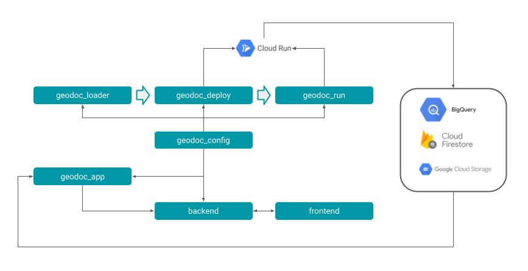

#  Perigon Scout

Perigon Scout is a web application designed for automatic land search based on user-defined criteria.
It is based on a several public geospatial data sources that requires individual approach to download, process and store them.

**Web application preview video** <br><br>
<a href="https://www.youtube.com/watch?v=1o5VWFYmls8">
    
</a>

**Warning !** <br>
*Be aware that the source code for this project is not fully available for public access within this repository.*

---
<br>

# Highlighted Features
- [parcels geometries downloader](./geodoc_loader/geodoc_loader/services/uldk.py) - An algorithm for asynchronous downloading of parcel geometries from ULDK service using `asyncio` with advanced technique for request points selection within given geometry with `shapely` library.
- [e-journals documents downloader](./geodoc_loader/geodoc_loader/services/ejournals.py) - A web scraping service for downloading documents from province's e-journals using `Selenium` and `BeautifulSoup` libraries.
- [automatic Docker deployment](./geodoc_deploy) - A set of CLIs for building and deploying Docker images of data acquisition services to Google Cloud Run.
- [Perigon Scout web application](./app_source) - A full-stack web application built with `React` and `Flask` frameworks, containerized with `Docker` and deployed on Google Cloud Platform.
- [universal multi worker queue processing](./geodoc_loader/geodoc_loader/download/process.py) - Set of tools for multi worker queue processing with different splitting methods to optimize workload distribution among workers without external queue management systems.
- [shapefiles preprocessing and concatenation](./geodoc_loader/geodoc_loader/handlers/collection.py) - A function that fully handles multiple shapefiles from a folder with column selection, data validation, reprojection and concatenation into a single GeoDataFrame using `GeoPandas` library.

# System modules
Perigon Scout system can be divided into two main modules: Data Acquisition and Web Application.
- Set of loader, deploy and run packages manage collection of services that are responsible for data acquisition and processing to build a geospatial database.
- Web application module contains the backend and frontend source code along with deployment and management scripts for the Perigon Scout web application.

**System general schema:** <br>


*GeoDoc is a legacy name for the whole system which is now part of Perigon Scout.*

## Data Acquisition
Perigon Scout databse is populated using a set of `python` packages that provide tools for downloading, processing, and handling geospatial data from various sources. Some datasets can't be downloaded in one go due to their size or structure, so the system uses contenerized services deployed on Google Cloud Platform (GCP) to handle data acquisition in a scalable and efficient manner. <br>
Listed packages are built to manage the whole process from configuration, deployment to running the services.

### geodoc_loader [link](./geodoc_loader)
A `python` package that provides tools for data acquisition services within the PerigonScout system. It includes modules for downloading, processing, and handling geospatial data from various sources.

**technological stack** <br>
BigQuery | firestore | google-cloud-storage | shapely | asyncio | Selenium | BeautifulSoup | PyMuPDF | requests | NumPy | Pillow | GeoPandas | pyproj | pandas | rasterio | importlib | SciPy | tqdm

### geodoc_deploy [link](./geodoc_deploy)
A `python` package that provides deployment and infrastructure management tools for the PerigonScout system. It includes modules for setting up cloud resources, managing deployments, and automating infrastructure tasks. <br>
It's main purpose is to build a Docker image of specific service and deploy it to Google Cloud Run. <br>
It provides set of CLIs to walk through the whole deployment process.

**technological stack** <br>
Google Cloud Platform | Docker | shutil | pathlib | importlib | subprocess

### geodoc_run [link](./geodoc_run)
A `python` package that provides tools for executing data acquisition services within the PerigonScout system.

**technological stack** <br>
Google Cloud Platform | Docker | subprocess

### geodoc_config [link](./geodoc_config)
The `geodoc_config` is a `python` package that consists a set of json configuration files that define various settings and parameters for the PerigonScout system and tools to access them.

### One-Time Upload
Notebooks used for one-time data downloads and uploads to BigQuery tables.
<br>[rasters](./rasters) 
<br>[vector data](./vector_data)

## Web Application

### geodoc_app [link](./geodoc_app)
A `python` package that contains the backend source code for the PerigonScout web application.

### Backend & Frontend [link](./app_source)
The `app_source` module contains the source code for the PerigonScout web application. The backend part is fully available within this repository, while the frontend part contains only some example sidebar components. It is based on `React` and `Flask` frameworks.

### App Deployment [link](./app_deploy)
The `app_deploy` module contains bash scripts for the PerigonScout application deployment on GCP or locally.

### Management Scripts [link](./management)
This directory contains management `bash` and `python` scripts for setting up and maintaining the Perigon Scout application.

---
<br><br>
# GeoDoc CLI
`geodoc_deploy` and `geodoc_run` packages offers a set of command line tools to manage deployment and running of GeoDoc services on Google Cloud Platform (GCP) using CloudRun.

## SETUP

Prepare the environment for the GeoDoc services. This includes setting up Google Cloud Storage buckets and BigQuery tables.
```bash
geodoc-setup-gcp-for-service --service SERVICE_NAME
```
- SERVICE_NAME: The name of the service to set up (e.g., bdot).

## DEPLOYMENT

### SAVE PACKAGES

Before building docker images, ensure that all required packages are saved to wheel files within geodoc_deploy/packages.
This can be done by running the following command:
```bash
sh management/packages/save_packages.sh
```

### BUILD IMAGE

To build a Docker image for a specific service, use the following command:
```bash
geodoc-build-image --service SERVICE_NAME
```
- SERVICE_NAME: The name of the service to build (e.g., bdot).

### PUSH IMAGE
To push the built Docker image to Google Container Registry, use:
```bash
geodoc-deploy-image-gcp --service SERVICE_NAME
```
- SERVICE_NAME: The name of the service to deploy (e.g., bdot).

### CREATE CloudRun JOB
To create a CloudRun job for a specific service, use:
```bash
geodoc-create-job --service SERVICE_NAME
```
- SERVICE_NAME: The name of the service to create a job for (e.g., bdot).

### FULL DEPLOYMENT
To deploy a service fully, including building the image and creating the CloudRun job, use:
```bash
geodoc-add-service --service SERVICE_NAME
```
- SERVICE_NAME: The name of the service to deploy (e.g., bdot).

### PREPARE GRID
To prepare the grid table with specific size use:
```bash
geodoc-prepare-grid --grid_size GRID_SIZE --min_side_buffer MIN_SIDE_BUFFER --delete_local DELETE_LOCAL
```
- GRID_SIZE: The size of the grid cells (e.g., 1000).
- MIN_SIDE_BUFFER: The minimum buffer for the source shape.
- DELETE_LOCAL(INT): Whether to delete local files after processing (default: 1).

## RUNNING

### ADD TO QUEUE

To add items to a queue for processing within specific services, use the following command:
```bash
geodoc-add-to-queue --service SERVICE_NAME --source_type SOURCE --source_key SOURCE_KEY --teryt_pattern TERYT_PATTERN --priority PRIORITY
```

- SERVICE_NAME: The name of the service to which the item should be added (e.g., bdot).
- SOURCE: The type of source from which the item (like teryt) is being added (default: administration_unit). The name has to be included in configs_map.json.
- SOURCE_KEY: The table of the source item (e.g., county).
- TERYT_PATTERN: The pattern for the TERYT code (e.g., '0201').
- PRIORITY: The priority of the item in the queue (default: 1). Higher numbers indicate higher priority.

### RUN LOCAL SERVICE

To run a service locally, use the following command:
```bash
geodoc-run-local-job --job SERVICE_NAME --e ENV_VAR1 --e ENV_VAR2
``` 

- SERVICE_NAME: The name of the service to run (e.g., bdot).
- ENV_VAR1, ENV_VAR2: Environment variables to set for the service (optional).

### RUN GCP SERVICE

To run a service on Google Cloud Platform (GCP), use the following command:
```bash
geodoc-run-job --job SERVICE_NAME --e ENV_VAR1 --e ENV_VAR2
``` 

- SERVICE_NAME: The name of the service to run on GCP (e.g., bdot).
- ENV_VAR1, ENV_VAR2: Environment variables to set for the service (optional).

# SERVICES

## SPATIAL DATA DOWNLOADER

Multi purpose service for handling different data sources downloaded based on TERYT codes.
The spatial-data-downloader is used only in deployment and run phase. For a setup and add-to-queue operations use supported services names.

```bash
geodoc-run-job --job spatial-data-downloader --e SERVICE=SERVICE_NAME --e QUEUE_LIMIT=QUEUE_LIMIT
```
- SERVICE_NAME: The name of the service to run (e.g., bdot).
- QUEUE_LIMIT: The maximum number of items to process in the queue (default: 5).

### SUPPORTED SERVICES
- bdot: Downloads and processes BDOT data for counties.
- soil-complexes: Downloads and processes soil complexes data based on a grid.
- parcels: Downloads and processes parcel data based on a grid.

## PARCELS

Separate instance of the spatial-data-downloader service to handle multi-worker processing of parcels data.
Designed for CloudRun jobs, running it locally will not launch multiple workers.
```bash
geodoc-run-job --job parcels --e QUEUE_LIMIT=QUEUE_LIMIT --e QUEUE_SPLIT_METHOD=QUEUE_SPLIT_METHOD
```
- QUEUE_LIMIT: The maximum number of items to process in the queue (default: 5).
- QUEUE_SPLIT_METHOD: The method to split the queue items (default: cut). Options are:
  - cut: Splits the queue items into equal parts for each worker by separating a list like [1,2], [3,4], [5,6].
  - modulo: Splits the queue items based on the modulo operation, allowing for more flexible distribution across workers like [1,4], [2,5], [3,6].

## EJOURNALS-DOWNLOADER
Service for downloading documents from province's e-journals.
```bash
geodoc-run-job --job ejournals-downloader --e QUEUE_LIMIT=QUEUE_LIMIT --e FILTER=FILTER --e TEXT_FILTER=TEXT_FILTER --e QUEUE_SPLIT_METHOD=QUEUE_SPLIT_METHOD
```

- QUEUE_LIMIT: The maximum number of items to process in the queue (default: 8).
- FILTER: A query "where" clause to filter queue (default: None) e.g. FILTER="province_id='30' AND year=2025".
- TEXT_FILTER: A text string to filter the documents by their title on the e-journals page (default: "zagosp") e.g. TEXT_FILTER="zagosp".
- QUEUE_SPLIT_METHOD: The method to split the queue items (default: cut).